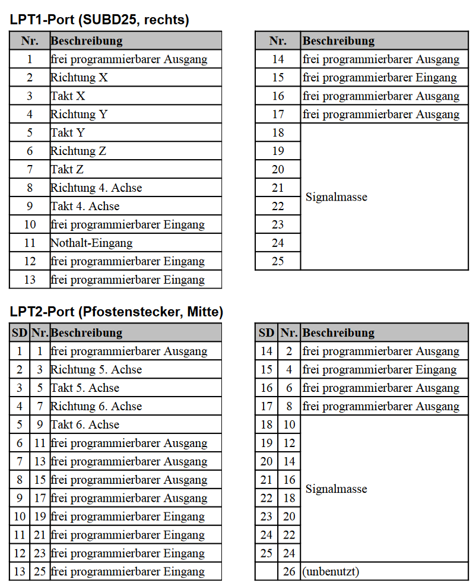

# CncPod2

<figure><figcaption></figcaption></figure>

 

<figure><figcaption></figcaption></figure>

Dieser Controller ist für die Verwendung mit dem Beamicon Hardware gedacht. Demnach wird das entsprechende Beamicon CncPod2 Modul zusätzlich benötigt.

Videoanleitung OPEN-CNC-Shield 2 - Beamicon:



### Überblick

* bis zu 6-Achsen
* 9 Eingänge
* 8 Ausgänge
* **Verbindung mit dem PC über RJ45 - LAN**
* **Beamicon unterstützt externe Handräder generell per USB-/RJ45-Verbindung an den Rechner und diese sind damit unabhängig vom OPEN-CNC-Shield 2**

### Unterstützung der OCS2 Funktionen 

<table><thead><tr><th width="313">Möglichkeiten OCS2</th><th width="432">Unterstützung des Estlcam Adapters</th></tr></thead><tbody><tr><td>6 Achsen</td><td>✅ Es können alle Achsen individuell angesteuert werden. Die Konfiguration auf dem OCS2 sollte nicht genutzt werden. Gleichlaufende Achsen können auch in der Beamicon Software konfiguriert werden.</td></tr><tr><td>16 Eingänge</td><td>⚠ 9</td></tr><tr><td>8 Ausgänge</td><td>✅</td></tr><tr><td>Spindelgeschwindigkeitssteuerung 0-5V, 0-10V oder 5V PWM</td><td>✅</td></tr><tr><td>Spindel An/Aus Anschluss zum Schalten eines Relais / Frequenzumrichters</td><td>✅</td></tr><tr><td><strong>Externe Bedienelemente</strong></td><td></td></tr><tr><td>Handrad / Encoder</td><td>❌</td></tr><tr><td>Motor Start Taster</td><td>❌</td></tr><tr><td>Programm Start Taster</td><td>❌</td></tr><tr><td>OK Taster</td><td>❌</td></tr><tr><td>Feedrate (Vorschubgeschwindigkeit)</td><td>❌</td></tr><tr><td>Rotation Speed (Spindelgeschwindigkeit)</td><td>❌</td></tr><tr><td>3-Achsen Joystick </td><td>❌</td></tr><tr><td>Auwahl X, Y, Z zur Wahl der Achsen für den Encoder</td><td>❌</td></tr><tr><td>Speed 1 und Speed 2 zur Einstellung der Encoder Geschwindigkeit</td><td>❌</td></tr></tbody></table>

### Pin Mapping 

Auszug aus dem Handbuch des CncPod2:

<figure><figcaption></figcaption></figure>

| LPT Pins                              | OCS2 Anschluss                                                                                  |
| ------------------------------------- | ----------------------------------------------------------------------------------------------- |
| **LPT1**                              |                                                                                                 |
| Pin 1 - freier Ausgang                | Spindle on/off                                                                                  |
| Pin 2-9 - Achsen X, Y, Z und 4. Achse | Achsen X,Y,Z und A                                                                              |
| Pin 10 - freier Eingang               | Eingang 3                                                                                       |
| Pin 11 - Nothalt                      | Eingang 8                                                                                       |
| Pin 12 - freier Eingang               | Eingang 2                                                                                       |
| Pin 13 - freier Eingang               | Eingang 1                                                                                       |
| Pin 14 - freier Ausgang               | Ausgang 1                                                                                       |
| Pin 15 - freier Eingang               | Eingang 4                                                                                       |
| Pin 16 - freier Ausgang               | Ausgang 3                                                                                       |
| Pin 17 - freier Ausgang               | Spindle pwm                                                                                     |
| **LPT2**                              |                                                                                                 |
| Pin 1 - freier Ausgang                | Ausgang 2                                                                                       |
| Pin 2-5 - 5. und 6. Achse             | Achse B und C                                                                                   |
| Pin 6 - freier Ausgang                | Ausgang 7                                                                                       |
| Pin 7 - freier Ausgang                | Ausgang 8                                                                                       |
| Pin 8 - freier Ausgang                | ENA - Enable                                                                                    |
| Pin 9 - freier Ausgang                | \*nicht verbunden                                                                               |
| Pin 10 - freier Eingang               | Alarm all - wird ausgelöst wenn ein Treiber ein alarm signal ausgibt(Überlastung / Fehler etc.) |
| Pin 11 - freier Eingang               | Eingang 5                                                                                       |
| Pin 12 - freier Eingang               | \*nicht verbunden                                                                               |
| Pin 13 - freier Eingang               | Eingang 7                                                                                       |
| Pin 14 - freier Ausgang               | Ausgang 4                                                                                       |
| Pin 15 - freier Eingang               | Eingang 6                                                                                       |
| Pin 16 - freier Ausgang               | Ausgang 5                                                                                       |
| Pin 17 - freier Ausgang               | Ausgang 6                                                                                       |

### Technische Details

Die schematischen Zeichnungen und DXF files zu der Platine sind auf Github zu finden:

{% embed url="https://github.com/timo1235/cnc-werkstatt/tree/master/OPEN-CNC-Shield%202.x/OCS2%20modules/ControllerModules/ControllerModule%20Beamicon" %}

