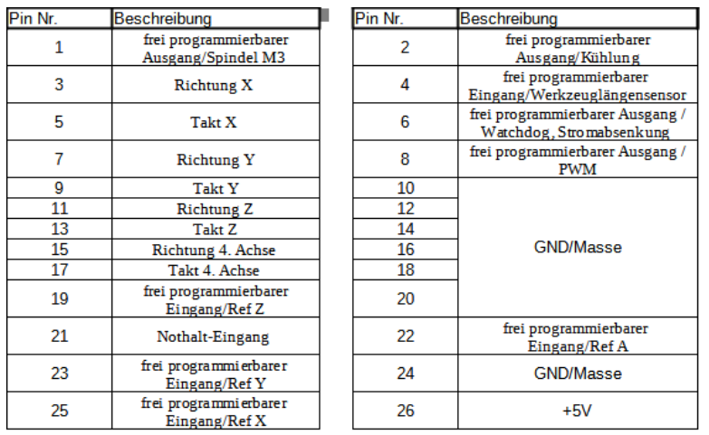

# Micropod

<figure><figcaption></figcaption></figure>

 

<figure><figcaption></figcaption></figure>

Dieser Controller ist für die Verwendung mit dem Beamicon Hardware gedacht. Demnach wird das entsprechende Beamicon Micropod Modul zusätzlich benötigt.

### Überblick

* bis zu 6-Achsen
* 5 Eingänge
* 3 Ausgänge
* **Verbindung mit dem PC über RJ45 - LAN**
* **Beamicon unterstützt externe Handräder generell per USB-/RJ45-Verbindung an den Rechner und diese sind damit unabhängig vom OPEN-CNC-Shield 2**

### Unterstützung der OCS2 Funktionen 

| Möglichkeiten OCS2                                                      | Unterstützung des Estlcam Adapters                                                                                                                                     |
| ----------------------------------------------------------------------- | ---------------------------------------------------------------------------------------------------------------------------------------------------------------------- |
| 6 Achsen                                                                | :warning: Steuerung von 4 Achsen. Weitere Achsen können auf dem [Shield gleichlaufend konfiguriert ](../../mainboard/anschluesse-jumper.md#achsenkonfiguration)werden. |
| 16 Eingänge                                                             | :warning: 6                                                                                                                                                            |
| 8 Ausgänge                                                              | :warning: 2                                                                                                                                                            |
| Spindelgeschwindigkeitssteuerung 0-5V, 0-10V oder 5V PWM                | :white\_check\_mark:                                                                                                                                                   |
| Spindel An/Aus Anschluss zum Schalten eines Relais / Frequenzumrichters | :white\_check\_mark:                                                                                                                                                   |
| **Externe Bedienelemente**                                              |                                                                                                                                                                        |
| Handrad / Encoder                                                       | :x:                                                                                                                                                                    |
| Motor Start Taster                                                      | :x:                                                                                                                                                                    |
| Programm Start Taster                                                   | :x:                                                                                                                                                                    |
| OK Taster                                                               | :x:                                                                                                                                                                    |
| Feedrate (Vorschubgeschwindigkeit)                                      | :x:                                                                                                                                                                    |
| Rotation Speed (Spindelgeschwindigkeit)                                 | :x:                                                                                                                                                                    |
| 3-Achsen Joystick                                                       | :x:                                                                                                                                                                    |
| Auwahl X, Y, Z zur Wahl der Achsen für den Encoder                      | :x:                                                                                                                                                                    |
| Speed 1 und Speed 2 zur Einstellung der Encoder Geschwindigkeit         | :x:                                                                                                                                                                    |

### Pin Mapping 

Auszug aus dem Micropod Handbuch:

<figure><figcaption></figcaption></figure>

| Micropod Pin/Funktion                                                                                                                                 | OCS2 Anschluss     |
| ----------------------------------------------------------------------------------------------------------------------------------------------------- | ------------------ |
| Pin 1 - freier Ausgang / Spindel                                                                                                                      | Spindle on/off     |
| Pin 3,5,7,9,11,13,15,17 - Achsen X,Y,Z und 4. Achse                                                                                                   | Achsen X,Y,Z und A |
| Pin 19 - freier Eingang / Ref Z                                                                                                                       | Eingang 3          |
| Pin 21 - Nothalt                                                                                                                                      | Eingang 5          |
| Pin 23 - freier Eingang / Ref Y                                                                                                                       | Eingang 2          |
| Pin 25 - freier Eingang / Ref X                                                                                                                       | Eingang 1          |
| Pin 2 - freier Ausgang / Kühlung                                                                                                                      | Ausgang 1          |
| Pin 4 - freier Eingang / Werzeuglängensensor                                                                                                          | Eingang 4          |
| 
Pin 6 - freier Ausgang / Stromabsenkung ⚠siehe kommentar unter Tabelle
 | Ausgang 2          |
| Pin 8 - freier Ausgang / PWM                                                                                                                          | Spindle pwm        |
| Pin 22 - freier Eingang / Ref A                                                                                                                       | Eingang 6          |


Leider gibt der Ausgang an Pin 6 des Micropods nur 1,6V anstatt der 2,5V(welche im Datenblatt stehen) im geschalteten Zustand raus. Demnach ist entweder meine Testplatine defekt  oder das Datenblatt nicht korrekt. \
Daraus ergibt sich, dass der Ausgang zu wenig Spannung schaltet und mit den meist verbauten ULN2003 Treibern auf den InOut Modulen nicht kompatibel ist. Also nicht funktioniert.


### Technische Details

Die schematischen Zeichnungen und DXF files zu der Platine sind auf Github zu finden:

{% embed url="https://github.com/timo1235/cnc-werkstatt/tree/master/OPEN-CNC-Shield%202.x/OCS2%20modules/ControllerModules/ControllerModule%20Beamicon" %}
