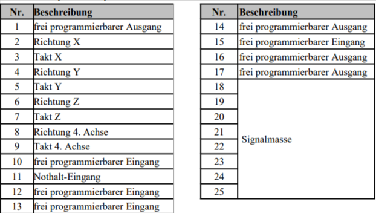

# Micropod

<figure><figcaption></figcaption></figure>

 

<figure><figcaption></figcaption></figure>

Dieser Controller ist für die Verwendung mit dem Beamicon Hardware gedacht. Demnach wird das entsprechende Beamicon Micropod Modul zusätzlich benötigt.

Videoanleitung OPEN-CNC-Shield 2 - Beamicon:



### Überblick

* bis zu 4-Achsen
* 6 Eingänge
* 2 Ausgänge
* **Verbindung mit dem PC über RJ45 - LAN**
* **Beamicon unterstützt externe Handräder generell per USB-/RJ45-Verbindung an den Rechner und diese sind damit unabhängig vom OPEN-CNC-Shield 2**

### Unterstützung der OCS2 Funktionen 

<table><thead><tr><th width="313">Möglichkeiten OCS2</th><th width="432">Unterstützung des Estlcam Adapters</th></tr></thead><tbody><tr><td>6 Achsen</td><td>⚠️ Steuerung von 4 Achsen. Weitere Achsen können auf dem <a href="../../mainboard-mini/anschluesse-jumper.md#achsenkonfiguration">Shield gleichlaufend konfiguriert </a>werden.</td></tr><tr><td>16 Eingänge</td><td>⚠️ 6</td></tr><tr><td>8 Ausgänge</td><td>⚠️ 2</td></tr><tr><td>Spindelgeschwindigkeitssteuerung 0-5V, 0-10V oder 5V PWM</td><td>✅</td></tr><tr><td>Spindel An/Aus Anschluss zum Schalten eines Relais / Frequenzumrichters</td><td>✅</td></tr><tr><td><strong>Externe Bedienelemente</strong></td><td></td></tr><tr><td>Handrad / Encoder</td><td>❌</td></tr><tr><td>Motor Start Taster</td><td>❌</td></tr><tr><td>Programm Start Taster</td><td>❌</td></tr><tr><td>OK Taster</td><td>❌</td></tr><tr><td>Feedrate (Vorschubgeschwindigkeit)</td><td>❌</td></tr><tr><td>Rotation Speed (Spindelgeschwindigkeit)</td><td>❌</td></tr><tr><td>3-Achsen Joystick </td><td>❌</td></tr><tr><td>Auwahl X, Y, Z zur Wahl der Achsen für den Encoder</td><td>❌</td></tr><tr><td>Speed 1 und Speed 2 zur Einstellung der Encoder Geschwindigkeit</td><td>❌</td></tr></tbody></table>

### Pin Mapping 

<figure><figcaption>
Auszug aus dem Micropod Handbuch für den Pfostenstecker. Leider passen hier die Zahlen nicht
</figcaption></figure>

<figure><figcaption>
Aus einem anderen Mircopod Handbuch. Hier passen die Zahlen.
</figcaption></figure>

| Micropod Pin/Funktion                                                                                                                                   | OCS2 Anschluss     |
| ------------------------------------------------------------------------------------------------------------------------------------------------------- | ------------------ |
| Pin 1 - freier Ausgang / Spindel                                                                                                                        | Spindle on/off     |
| Pin 2,3,4,5,6,7,8,9 - Achsen X,Y,Z und 4. Achse                                                                                                         | Achsen X,Y,Z und A |
| Pin 10 - freier Eingang / Ref Z                                                                                                                         | Eingang 3          |
| Pin 11- Nothalt                                                                                                                                         | Eingang 5          |
| Pin 12 - freier Eingang / Ref Y                                                                                                                         | Eingang 2          |
| Pin 13 - freier Eingang / Ref X                                                                                                                         | Eingang 1          |
| Pin 14 - freier Ausgang / Kühlung                                                                                                                       | Ausgang 1          |
| Pin 15 - freier Eingang / Werzeuglängensensor                                                                                                           | Eingang 4          |
| 
Pin 16 - freier Ausgang / Stromabsenkung ⚠️siehe kommentar unter Tabelle
 | Ausgang 2          |
| Pin 17 - freier Ausgang / PWM                                                                                                                           | Spindle pwm        |
| Pin 24- freier Eingang / Ref A                                                                                                                          | Eingang 6          |


Leider gibt der Ausgang an Pin 16 des Micropods nur 1,6V anstatt der 2,5V(welche im Datenblatt stehen) im geschalteten Zustand raus. Demnach ist entweder meine Testplatine defekt  oder das Datenblatt nicht korrekt. \
Daraus ergibt sich, dass der Ausgang zu wenig Spannung schaltet und mit den meist verbauten ULN2003 Treibern auf den InOut Modulen nicht kompatibel ist. Also nicht funktioniert.


### Technische Details

Die schematischen Zeichnungen und DXF files zu der Platine sind auf Github zu finden:

{% embed url="https://github.com/timo1235/cnc-werkstatt/tree/master/OPEN-CNC-Shield%202.x/OCS2%20modules/ControllerModules/ControllerModule%20Beamicon" %}
