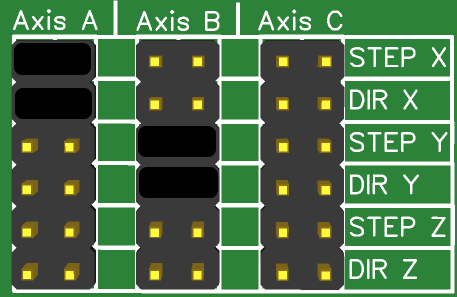

# Dual Adapter

<div>

<figure><figcaption></figcaption></figure>

 

<figure><figcaption></figcaption></figure>

 

<figure><figcaption></figcaption></figure>

</div>

Dieser Adapter wird auf den Steckplatz für ControllerModule auf dem OCS2 aufgesetzt und bietet Platz für zwei zusätzliche Module. Dadurch ist es möglich, zwei unterschiedliche ControllerModule auf einem OCS2 zu betreiben. Über einen Schalter am Dual-Adapter lässt sich komfortabel zwischen den beiden Modulen wechseln. Es ist jedoch zu beachten, dass die Maschine zu jedem Zeitpunkt nur durch ein Modul gesteuert werden kann.

Ein praxisrelevantes Beispiel wäre der Einsatz des ControllerModules FluidNC für Laseranwendungen, während das ControllerModule Estlcam für sämtliche Fräsoperationen genutzt wird.

Hier ein kurzes Video dazu:


### Überblick

* Nutzung zweier ControllerModule ohne umstecken
* Wechsel, welches Modul aktiv ist, mit einem Schalter
* Folgende Signale werden umgeschaltet/getrennt:
  * STEP und DIR für alle 6 Achsen
  * Spindel on/off
  * Spindel PWM
  * Alle 8 Ausgänge
* Folgende Signale liegen an beiden ControllerModules an(generell alle Eingangssignale):
  * Eingang 1-16
  * Encoder A/B
  * Motor Start (Bedienteil)
  * Programm Start (Bedienteil)
  * OK-Taste (Bedienteil)
  * Feedrate (Bedienteil)
  * Rotation Speed (Bedienteil)
  * Joystick X/Y/Z (Bedienteil)
  * Auswahl X/Y/Z (Bedienteil)
  * Speed 1/2 (Bedienteil)
  * ENA/Enable der Motortreiber
  * ALARM\_ALL der Motortreiber
  * I2C vom ESP32

### Schalter&#x20;

Der Schalter besteht aus 3 Pins. Der mittlerer Pin(COM) kann entweder mit "First" verbunden werden oder mit "Second". Passende Schalter hierfür findet man unter dem Namen "SPDT" oder auch "ON-OFF-ON".

Beide ControllerModules sind dauerhaft mit Strom und den oben beschriebenen Signalen verbunden. Es werden nur die erwähnten Signale umgeschaltet.

<figure><figcaption></figcaption></figure>

### ENA/Enable der Treiber

In der derzeitigen Ausführung des Dual-Adapters sind die ENA-Anschlüsse beider ControllerModule dauerhaft miteinander verbunden. Es ist daher unerlässlich, darauf zu achten, dass die ControllerModule die ENA-Funktion nicht aktivieren oder schalten. Keinesfalls dürfen beide ControllerModule gleichzeitig den ENA-Anschluss verwenden - während der Betrieb mit einem aktiven Modul funktioniert, würde das Schalten beider Module - eines auf GND und das andere auf 5V - zu einem Kurzschluss führen, der potenziell die Steuerung beschädigen kann.

Die sicherste Maßnahme ist es, die ENA-Funktion an beiden Controllern nicht zu verwenden. Stattdessen sollten die Motoren mit dem ENA-Jumper direkt auf dem OCS2 Shield in den korrekten Zustand versetzt werden.

In zukünftigen Versionen des Dual-Adapters könnte das Verhalten der ENA-Anschlüsse einer Überarbeitung unterzogen werden, um eine verbesserte Funktionalität zu gewährleisten.

### Achsenkonfiguration

Die Achsenkonfiguration wird auf dem [OCS2 selbst vorgenommen](../mainboard/anschluesse-jumper.md#achsenkonfiguration). Daher teilen sich die beiden ControllerModule die Konfiguration. Die Konfiguration darf daher nicht im Konflikt zueinander stehen.&#x20;

<details>

<summary>Beispiel für einen Konflikt</summary>

Szenario:

* MPCNC mit 2 Motoren für x-Achse, 2 Motoren für y-Achse und 1 Motor für z-Achse
* ControllerModule FluidNC und ControllerModule Estlcam am Dual Adapter angeschlossen
*

    | OCS2 Anschluss | Motor |
    | -------------- | ----- |
    | X              | X1    |
    | Y              | Y1    |
    | Z              | Z     |
    | A              | X2    |
    | B              | Y2    |

Die Achsenkonfiguration auf dem OCS2 muss für Estlcam bei diesem Anschluss so aussehen:



Bei FluidNC hätte man nun die Möglichkeit, alle Motoren einzeln anzusteuern und die Achsen über die Konfiguration miteinander zu verbinden. Das wird aber in diesem Szenario **nicht** funktionieren. Sobald FluidNC versucht den Motor der A-Achse einzeln anzusteuern, dreht der X-Motor sich mit, da dies ja oben die Jumper oben eingestellt wurde! Dies kann zu Schäden an der Maschine führen!

</details>

<details>

<summary>Beispiel für eine saubere Achsenkonfiguration</summary>

Szenario:

* MPCNC mit 2 Motoren für x-Achse, 2 Motoren für y-Achse, 1 Motor für z-Achse udn außerdem 1 Motor für eine Drehachse
* ControllerModule FluidNC und ControllerModule Estlcam am Dual Adapter angeschlossen
*

    | OCS2 Anschluss | Motor               |
    | -------------- | ------------------- |
    | X              | X1                  |
    | Y              | Y1                  |
    | Z              | Z                   |
    | A              | X2                  |
    | B              | Y2                  |
    | C              | Drehachse(4. Achse) |

Die Achsenkonfiguration auf dem OCS2 muss für Estlcam bei diesem Anschluss so aussehen:


Estlcam kann die 4. Achse nicht nutzen und daher bleibt die C-Achse frei.

Bei FluidNC kann diese jedoch genutzt werden. Außerdem darf für jede Achse nur ein Motor eingerichtet sein - gleichlaufende Motoren sind schließlich schon über die Achsenkonfiguration eingerichtet.

Hier ein möglicher Auszug aus einer FluidNC konfiguration:

```yaml
axes:
  x:
    motor0:
      stepstick:
        direction_pin: i2so.1
        step_pin: i2so.0

  y:
    motor0:
      stepstick:
        direction_pin: i2so.3
        step_pin: i2so.2

  z:
    motor0:
      stepstick:
        direction_pin: i2so.5
        step_pin: i2so.4

  a: 
    motor0:
      stepstick:
        direction_pin: i2so.11
        step_pin: i2so.10
```

</details>

### Kompatibilität

Es sind nicht alle Kombinationen von Controller inkl. verschiedener Konfigurationen durchgetestet. Die folgende Liste/Hinweise wird stetig erweitert.


Es liegt in der eigenen Verantwortung dafür zu Sorgen, dass keine Abhängigkeiten zwischen den ControllerModulen entstehen. Falls die gemeinsam genutzen Leitungen von einem Controller durch Fehlkonfiguration zum Beispiel als Ausgang genutzt werden, kann die Steuerung Schaden nehmen


#### Estlcam und FluidNC

Diese Controller-Kombination funktioniert einwandfrei. Der ENA Hinweis oben sollte beachten werden. Dazu in der FluidNC Konfiguration `shared_stepper_disable_pin: i2so.12` auskommentieren oder löschen.

Außerdem muss die Achsenkonfiguration beachtet werden. Dazu gibt es einen Abschnitt auf dieser Seite.
