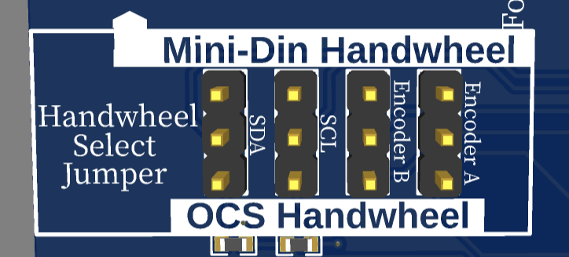

# Estlcam Klemmenadapter XL

<figure><figcaption></figcaption></figure>

Dieser Controller ist speziell für die Verwendung mit der Software [Estlcam ](https://www.estlcam.de/)konzipiert, die von Christian Knüll entwickelt wurde und die Anforderungen im Hobby- und semiprofessionellen Bereich optimal erfüllt. Das Controller-Modul nutzt die neueste Estlcam-Hardware und bietet die erweiterten Funktionen des Klemmenadapters XL.

### Überblick


nur mit Estlcam Version 12.100 oder höher kompatibel! Für ältere Estlcam Versionen kann das [ControllerModule Estlcam mit Arduino Mega](estlcam.md) genutzt werden.


* 3-Achsen (eine Achse mit zwei individuellen Motoren zum Ausrichten einer Portalfräse über Estlcam)
* Für Motoren/Treiber/Endstufen mit 5V Takt und Richtungssignal
* 16 Eingänge
* 8 Ausgänge
* 7 analoge Eingänge z.B. für Temperatursensoren, Druckmesser etc.
* Impulsmessung z.B. für Durchflusssensoren...
* Nutzung von originalen Estlcam Mini-Din Handrad oder OCS2 Handrad
* **Verbindung mit dem PC über galvanisch getrenntem USB-C-Anschluss**
  * Schutz des Computers vor Kurzschlüssen
  * Erhöhte Stabilität und Entstörung der Verbindung

### Unterstützung der OCS2 Funktionen

<table><thead><tr><th width="313">Möglichkeiten OCS2</th><th width="432">Unterstützung des Estlcam Adapters</th></tr></thead><tbody><tr><td>6 Achsen</td><td>⚠️ Steuerung von 3 Achsen. Die Y-Achse ist auf Y-rechts und Y-Links aufgeteilt. Estlcam bietet für diese Achse eine Autosquaring-Funktion. Weitere Achsen können auf dem <a href="../mainboard-mini/anschluesse-jumper.md#achsenkonfiguration">Shield gleichlaufend konfiguriert </a>werden.</td></tr><tr><td>16 Eingänge</td><td>✅ 16 </td></tr><tr><td>8 Ausgänge</td><td>✅ 8</td></tr><tr><td>Spindelgeschwindigkeitssteuerung 0-5V, 0-10V oder 5V PWM</td><td>✅</td></tr><tr><td>Spindel An/Aus Anschluss zum Schalten eines Relais / Frequenzumrichters</td><td>✅</td></tr><tr><td><strong>Externe Bedienelemente</strong></td><td></td></tr><tr><td>Handrad / Encoder</td><td>✅</td></tr><tr><td>Motor Start Taster</td><td>✅</td></tr><tr><td>Programm Start Taster</td><td>✅</td></tr><tr><td>OK Taster</td><td>✅</td></tr><tr><td>Feedrate (Vorschubgeschwindigkeit)</td><td>✅</td></tr><tr><td>Rotation Speed (Spindelgeschwindigkeit)</td><td>✅</td></tr><tr><td>3-Achsen Joystick </td><td>✅</td></tr></tbody></table>

### Zusätzliche Funktionen direkt auf dem ControllerModule

* 7 analoge Eingänge
  * 3 x Widerstandsmessung (Beschriftung 1R, 2R, 3R)
  * 2 x 0-20mA Strommessung (Beschriftung 4I, 5I)
  * 2 x 0-10V Spannungsmessung (Beschriftung 6U, 7U)
* Anschluss des originalen Estlcam Handrads über eine Mini-Din Buchse
* 5V Step Signal für einen Stepper Treiber
  * Dieser Ausgang erzeugt präzise getaktete Impulse. Z.B. für Nebelkühlung mit Injektorventilen oder zentrale Schmierstoffdosierung mit Magnetpumpen.
* Frequenz-/Impulszähleingang (5V TTL)
  * Z.B. zur Überwachung des Spindelkühlmittelflusses mit einem Turbinen-Durchflussmesser.

### Achsen Konfiguration

Eine neue Funktion der Estlcam-Hardware ermöglicht die individuelle Steuerung einer Achse mit zwei Motoren. Dies ist besonders bei Portalfräsen nützlich, um die Ausrichtung der Achse präzise einzustellen. Diese Funktion übernimmt die Aufgabe des Autosquarings, das bislang vom OCS2-System bereitgestellt wurde – allerdings nur für eine Achse. Müssen mehrere Achsen ausgerichtet werden, kann dafür weiterhin die [OCS2 Autosquare Funktion](../guides-zubehoer/autosquaring.md) genutzt werden (unbedingt auf die doppelte Y-Achse bei der Konfiguration achten!)&#x20;

| Estlcam Achse | OCS2 Achse |
| ------------- | ---------- |
| X             | X          |
| YL            | Y          |
| YR            | A          |
| Z             | Z          |

### Handrad Jumper

<figure><figcaption></figcaption></figure>

Auf dem Controller-Modul befinden sich vier Jumper, die zur Auswahl des angeschlossenen Handrads verwendet werden. Die Jumper lassen sich entweder auf „OCS Handwheel“ oder „Mini-Din Handwheel“ einstellen.

**OCS Handwheel:** Diese Einstellung ermöglicht die Nutzung des Handrads in Estlcam, das an das OCS2 angeschlossen ist. Dabei spielt es keine Rolle, ob das Handrad über ein Panel-Modul oder per WiFi verbunden ist. \
_Technische Umsetzung (Hintergrundinformation): Auf dem Controller-Modul ist ein Atmega328 integriert, der die Signale vom OCS2 (Joystick, Taster etc.) einliest und über I2C an Estlcam weiterleitet – genauso wie es das originale Estlcam-Handrad macht._

**Mini-Din Handwheel:** In dieser Jumperstellung kann das originale Estlcam-Handrad mit Mini-Din-Stecker genutzt werden.


**Hinweis für beide Varianten:** Zuerst die Stromversorgung einschalten und das Handrad anschließen, dann Estlcam starten und die Steuerung programmieren. Im „Programmierfenster“ von Estlcam sollte dann eine Meldung wie „Zusatzmodul Handrad 001“ erscheinen. \
\
Es ist außerdem nicht möglich, das Mini-Din-Handrad und ein OCS2-Handrad gleichzeitig zu verwenden. Nur eines von beiden kann genutzt werden.


### Pin Mapping

Hier einmal eine Übersicht über die Funktionen und Pins

| Klemmenadapter Pin | OCS2 Pin                           | zusätzliche Info                                                                        |
| ------------------ | ---------------------------------- | --------------------------------------------------------------------------------------- |
| Eingänge 1-16      | Eingänge 1-16 an den InOut-Modulen | [ein-und-ausgaenge-nutzen.md](../guides-zubehoer/ein-und-ausgaenge-nutzen.md "mention") |
| Ausgänge 1-8       | Ausgänge 1-8 an den InOutModulen   | [ein-und-ausgaenge-nutzen.md](../guides-zubehoer/ein-und-ausgaenge-nutzen.md "mention") |
| Ausgang 9          | ENA                                | mit Ausgang 9 in Estlcam kann der Enable der Treiber auf dem OCS2 geschaltet werden     |
| STEP X             | STEP X                             |                                                                                         |
| DIR X              | DIR X                              |                                                                                         |
| STEP YL            | STEP Y                             |                                                                                         |
| STEP YR            | STEP A                             |                                                                                         |
| DIR Y              | DIR Y, DIR A                       |                                                                                         |
| STEP Z             | STEP Z                             |                                                                                         |
| DIR Z              | DIR Z                              |                                                                                         |

### Analoge Eingänge auf dem ControllerModule

Es gibt insgesamt 7 analoge Eingänge, darunter

* 3 x Widerstandsmessung (Beschriftung 1R, 2R, 3R)
* 2 x 0-20mA Strommessung (Beschriftung 4I, 5I)
* 2 x 0-10V Spannungsmessung (Beschriftung 6U, 7U)

> * Analoge Sensoren können zur Überwachung von Temperaturen, Drücken, Füllständen und vielem mehr genutzt werden - z.B:
>   * Überlastschutz für den Fräsmotor durch Überwachung von Spindel- und Kühlwassertemperatur oder Frequenzumrichter Ausgangsleistung...
>   * Überwachung Vakuum Unterdruck, so dass die Maschine bei Leckagen rechtzeitig stoppt bevor die Haltekraft für das Werkstück zu gering wird...
>   * Überwachung Druckluft Mindestdruck z.B. um Fehlfunktionen von Werkzeugwechslern oder Spannvorrichtungen zu vermeiden...
>   * Füllstandsüberwachung für Minimalmengenschmierungen etc...\
>
> * **Anschlussklemmen**:
>   * GND: Masseanschluss / 0V
>   * 1R / 2R / 3R: Eingänge 1 bis 3 für Widerstandsmessung...
>   * 4I / 5I: Eingänge 4 und 5 für Strommessung...
>   * 6U / 7U: Eingänge 6 und 7 für Spannungsmessung...
>   *   V-Board: Versorgungsspannung für den Sensor, sofern er eine Stromversorgung benötigt.
>
>       * Spannung abhängig von der am OCS2 angeschlossenen Spannung
>
>
> * **Widerstandsmessung**:
>   * Z.B. für
>     * [Temperatursensoren](https://www.sensorshop24.de/einschraubtemperaturfuehler-mit-m6-gewinde-und-17mm-einbaulaenge) Typ PT1000 (NICHT PT100) oder NTC5K
>     * [Füllstandsensoren 0-190 Ohm](https://de.aliexpress.com/item/4001224884687.html)
>   * Bzw. generell Sensoren die mit deutlichen Widerstandsänderungen im Bereich von ca. 0 bis 10kOhm arbeiten...
>   *   Anschluss:
>
>       * 1 Anschluss des Sensors mit "GND" verbinden...
>       * Den anderen mit 1R / 2R oder 3R verbinden...
>       * Welcher Anschluss mit GND und welcher mit 1R / 2R oder 3R verbunden wird ist egal...
>       * Anschluss "V-Board" wird für Widerstandsmessungen generell nicht genutzt...
>
>
> * **Strommessung**:
>   * Z.B. für [Druck und Vakuumsensoren...](https://www.sensorshop24.de/drucktransmitter-g1-4-oder-g1-2-fuer-ueber-und-unterdruck-mit-normstecker-0-10v-4-20ma)
>   * Manche Frequenzumrichter können auch die Ausgangsleistung oder Spindelstrom als 4-20mA Signal ausgeben...
>   * Bzw. generell Sensoren und Geräte die das Messergebnis als Strom von 4-20mA (bzw. 0-20mA) ausgeben...
>   * Solche Sensoren gibt es sowohl mit 2 als auch 3 Anschlussleitungen, mit selbst geliefertem oder vom OCS2 bezogenem Strom:
>     * 2 Leiter / über Adapter versorgt (die meisten Sensoren dieses Typs):
>       * Verbinde den "Versorgungsspannungsanschluss / +" des Sensors mit "V-Board"
>       * Verbinde "GND / -" des Sensors mit einem der Eingänge "4I" oder "5I"
>       * Der oben verlinkte Sensor in der 4-20mA Version wäre z.B. von diesem Typ und es würde
>         * "Pin1 / +Ub" mit "V-Board"
>         * "Pin2 / GND" mit Eingang "4I" oder "5I" verbunden...
>     * 2 Leiter / eigene Stromquelle (z.B. Frequenzumrichter mit 4-20mA Stromausgang):
>       * Verbinde "GND / "-" des Sensors mit "GND"
>       * Verbinde das Ausgangssignal des Sensors mit einem der Eingänge "4I" oder "5I"
>     *   3 Leiter:
>
>         * Verbinde "GND / -" des Sensors mit "GND".
>         * Verbinde das Ausgangssignal des Sensors mit einem der Eingänge "4I" oder "5I"
>         * Verbinde den "Versorgungsspannungsanschluss / +" des Sensors mit "V-Board"
>
>
> * **Spannungsmessung**:
>   * Z.B. für [Druck und Vakuumsensoren...](https://www.sensorshop24.de/drucktransmitter-g1-4-oder-g1-2-fuer-ueber-und-unterdruck-mit-normstecker-0-10v-4-20ma)
>   * Manche Frequenzumrichter können auch die Ausgangsleistung oder Spindelstrom als 0-10V Signal ausgeben...
>   * Bzw. generell Sensoren und Geräte die ihr Messergebnis als Spannung zwischen 0 und 10V ausgeben...
>   * Anschluss:
>     * Verbinde "GND / -" des Sensors mit "GND".
>     * Verbinde das Ausgangssignal des Sensors mit einem der Eingänge "6U" oder "7U"&#x20;
>     * Verbinde den "Versorgungsspannungsanschluss / +" des Sensors mit "V-Board"
>       * Falls das Signal von einem Gerät mit eigener Stromversorgung wie z.B. einem Frequenzumrichter stammt entfällt diese Verbindung...
>     * Beim oben verlinkten Sensor in der 0-10V Version würde
>       * "Pin1 / +Ub" mit "V-Board" verbunden.
>       * "Pin2 / GND" mit "GND" verbunden.
>       * "Pin3 / Uout" mit Eingang "6U" oder "7U" verbunden.

**Quelle:** [**https://www.estlcam.de/tx.php#analog**](https://www.estlcam.de/tx.php#analog)

### Frequenz-/Impulszähleingang - 5V TTL (FRQ)

> * Das ControllerModule hat einen Frequenzzählereingang der z.B. für [Durchflusssensoren](https://www.mouser.de/ProductDetail/Seeed-Studio/114991172?qs=EU6FO9ffTwf%252BgI%2FG0WdEQA%3D%3D) zur Überwachung wassergekühlter Fräsmotoren verwendet werden kann...
> * Achtung: nur mit 5V Sensoren kompatibel!
> * Anschlüsse:
>   * GND: Masse (schwarzes Kabel beim oben verlinkten Sensor)
>   * FRQ: 5V TTL Frequenzzählereingang (gelbes Kabel beim oben verlinkten Sensor)
>   * \+5V: 5V zur Versorgung des Sensors (rotes Kabel beim oben verlinkten Sensor)

**Quelle:** [**https://www.estlcam.de/tx.php#freq**](https://www.estlcam.de/tx.php#freq)

### 5V Step Impulsausgang(FogPulse)

Dieser Ausgang erzeugt präzise getaktete Impulse. Z.B. für Nebelkühlung mit Injektorventilen oder zentrale Schmierstoffdosierung mit Magnetpumpen.

**Anschluss an externe Treiber:**

* FogPulse: Step Signal, wird an STEP/PUL eines externen Treibers angeschlossen.
* GND: Masse - wird mit GND des externen Treibers verbunden.
* DIR des externen Treibers kann weggelassen werden. Sollte der Motor in die falsche Richtung drehen, kann DIR an 5V angeschlossen werden.

### Konfiguration in Estlcam

Das ControllerModule muss in Estlcam als Klemmenadapter eingestellt sein.

Schaue für detaillierte Informationen in die Estlcam Dokumentation: [https://www.estlcam.de/tx.php#install](https://www.estlcam.de/tx.php#install)

### Technische Details

Die schematischen Zeichnungen und DXF files zu der Platine sind auf Github zu finden:

{% embed url="https://github.com/timo1235/cnc-werkstatt/tree/master/OPEN-CNC-Shield%202.x/OCS2%20modules/ControllerModules/ControllerModule%20Estlcam%20KLemmenadapter%20XL" %}

