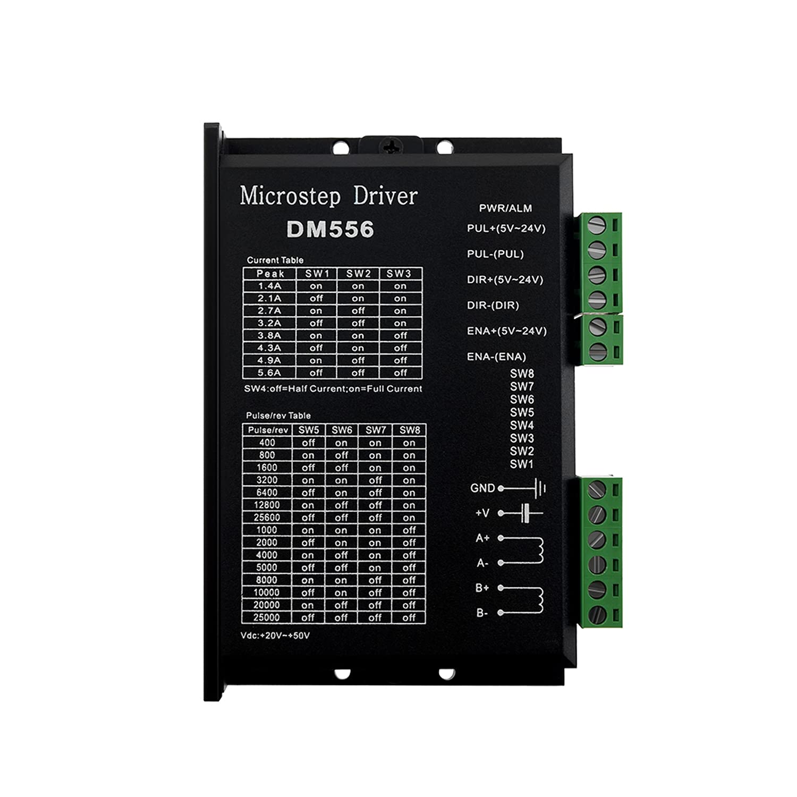
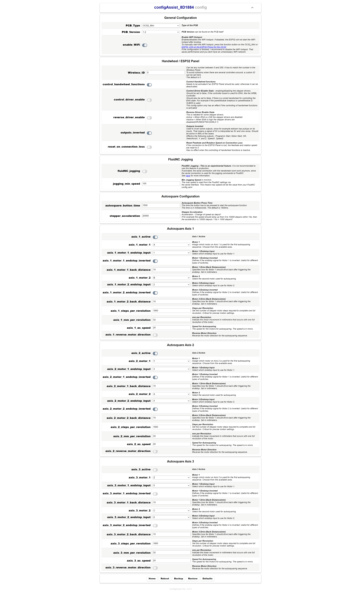
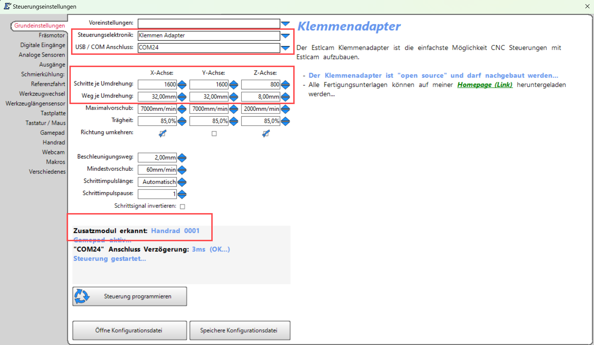

# Einrichtung am Beispiel einer MPCNC

Hier beschreibe ich, wie ich das **ControllerModule Estlcam Klemmenadapter XL** an meiner MPCNC angeschlossen habe.

Die Anleitung beinhaltet:

* Nutzung des OPEN-CNC-Shield 2 Mini
* Anschließen der Treiber/Motoren und deren Konfiguration
* Autosquaring der X- und Y-Achse mit dem OCS2
  * Konfiguration der Endschalter für jeden Motor
* Nutzung des OCS2 Wireless Handrads oder des Original Estlcam Handrads
* Steuerung des Enable der Treiber
* Einstellungen in Estlcam

### Benötigte Komponenten:

* [OPEN-CNC-Shield 2 Mainboard Mini](https://shop.altholtmann.com/OPEN-CNC-Shield-2-Mainboard-Mini/SW10046) oder [OPEN-CNC-Shield 2 Mainboard](https://shop.altholtmann.com/OPEN-CNC-Shield-2-Mainboard/SW10017)
* [ControllerModule Estlcam Klemmenadapter XL](https://shop.altholtmann.com/ControllerModule-Estlcam-Klemmenadapter-XL/SW10047)
* 5 x externe Schrittmotortreiber, ich nutze [DM556](https://s.click.aliexpress.com/e/_DCXvp5R)

### Anschluss Treiber / Motoren und Endschalter

<figure><figcaption></figcaption></figure>

#### Verbindungsschema für externe Treiber

Jeder Motor besitzt einen externen Treiber, ich nutze aktuell DM556([Amazon](https://amzn.to/3AxYHDO)) an meiner MPCNC.


Achtung, bei einigen Treiber gibt es einen Schalter(5V oder 24V) für die Logikspannung. Dieser muss auf 5V stehen, damit die Treiber mit dem OCS2 funktionieren.


| Anschluss Treiber  | Anschluss OCS2 |
| ------------------ | -------------- |
| PUL+ / STEP / Takt | STEP           |
| DIR + / Richtung   | DIR            |
| ENA + / Enable     | ENA            |
| PUL -              | GND            |
| DIR -              | GND            |
| ENA -              | GND            |

#### Einstellungen des Treibers

<figure><figcaption></figcaption></figure>

Bei den DM556 Treibern müssen die Schalter SW1, SW2 und SW3 je nach verwendetem Motor eingestellt werden. Ich habe für meine NEMA17 2.1A eingestellt, also:

* SW1 off
* SW2 on
* SW3 on
* SW4 off

Es sei dazu gesagt, dass ich auch nur einen Laser mit der MPCNC verfahre. Kommt ein Fräser zum Einsatz will man die Leistung evtl. höher stellen.

Die anderen Schalter stellen die Schritte ein. Ich habe die X- und Y-Achse jeweils auf 1600 Schritte, also:

* SW5 off
* SW6 off
* SW7 on
* SW8 on

Die Z-Achse habe ich auf 800 Schritte eingestellt:

* SW5 on
* SW6 off
* SW7 on
* SW8 on

#### Achsenkonfiguration auf dem OCS2

Wie oben im Screenshot zu sehen ist, setze ich folgende Jumper bei der Achsenkonfiguration:

* Axis B -> STEP X
* Axis B -> DIR X

Damit bekommt der Motor für X2(angeschlossen an Axis B) dieselben Schritte wie der Motor X1(angeschlossen an Axis X). Die Y-Achse muss beim Klemmenadapter XL nicht gleichlaufend konfiguriert werden, da diese bereits auf Axis A gespiegelt wird.

### Anschluss Endschalter

Ich habe die Endschalter([Amazon](https://amzn.to/3NY1Fo9)) bei mir als normally closed angeschlossen und ich schalte mit GND. Daher müssen die Switches an den Eingängen in Richtung (-) gestellt werden. Ich nutze folgende Eingänge:

* Eingang 1 für Endschalter Motor X1
* Eingang 2 für Endschalter Motor X2
* Eingang 3 für Endschalter Motor Y1
* Eingang 4 für Endschalter Motor Y2

Siehe [ein-und-ausgaenge-nutzen.md](../../guides-zubehoer/ein-und-ausgaenge-nutzen.md "mention") für mehr Informationen zur Nutzung der Eingänge.

### Konfiguration des OCS2 ESP32 für Autosquaring

<figure><figcaption></figcaption></figure>

Meine Konfiguration ist im obigen Screenshot zu sehen. Damit ist Autosquaring für die X- und die Y-Achse aktiviert. Zu beachten sind die invertierten Enschalter, sowie, dass die richtigen Achsen ausgewählt sind.&#x20;

Sind die Einstellungen gemacht, können wir unten in dem Webinterface auf "Reboot" klicken. Damit sind die Änderungen aktiv.&#x20;

### Estlcam Konfiguration

#### Steuerung

<figure><figcaption></figcaption></figure>

Hier einmal das Einstellungsfenster aus Estlcam für meine MPCNC. Die Steps müssen natürlich die Einstellungen an den Stepper Treibern widerspiegeln.


Im Programmierfenster erscheint die Meldung: **"Zusatzmodul erkannt: Handrad 0001"**. Dies weist darauf hin, dass der Handrad-Schalter entweder auf _Mini-DIN_ steht und das originale Handrad erkannt wurde, oder auf _OCS2_ eingestellt ist, sodass ein daran angeschlossenes Handrad verwendet werden kann.


#### Eingänge

<figure><figcaption></figcaption></figure>

Ich nutze nur die ersten 4 Eingänge für meine Endschalter. Diese sind, wie oben beschrieben als NC angeschlossen, daher müssen die Eingänge in Estlcam invertiert werden.

#### Ausgang 9 / ENA

<figure><figcaption></figcaption></figure>

Ausgang 9 kann durch setzen des Jumpers auf dem ControllerModule mit ENA der Treiber verbunden werden. Dann kann man die Treiber über Estlcam aktivieren oder deaktivieren. Dies kann auch in den G-Code als Startskript oder ähnliches eingebaut werden.

Ich selbst nutze diese Funktion nicht.

#### Handrad

<figure><figcaption></figcaption></figure>

Egal, ob es sich um ein originales Handrad oder ein OCS2-Handrad handelt – hier können die verschiedenen Funktionen aktiviert und kalibriert werden.&#x20;


Wird ein OCS2-Handrad verwendet, wird dringend empfohlen, die integrierte Kalibrierungsfunktion zu nutzen, bevor in Estlcam kalibiert wird.


&#x20;

