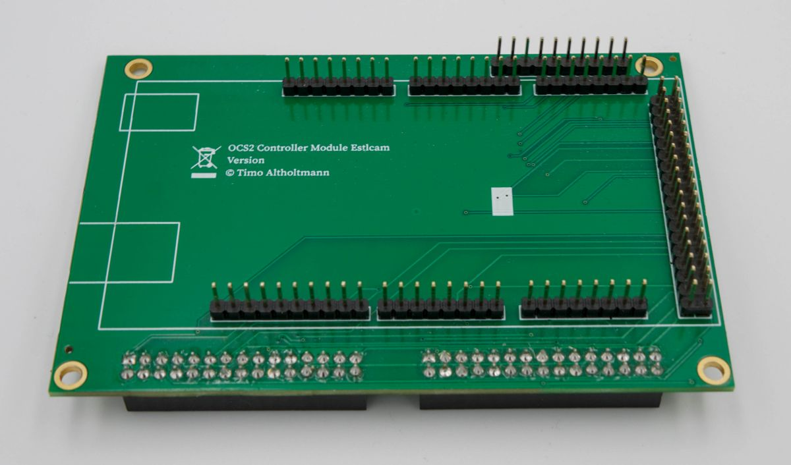
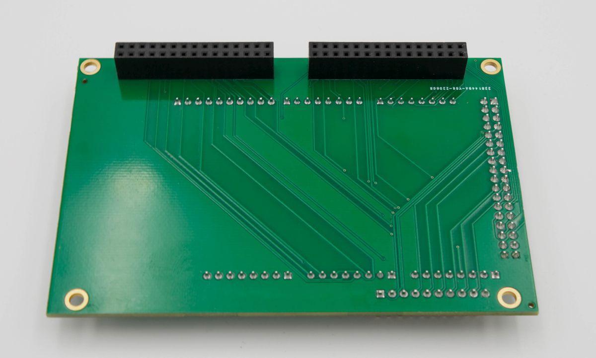
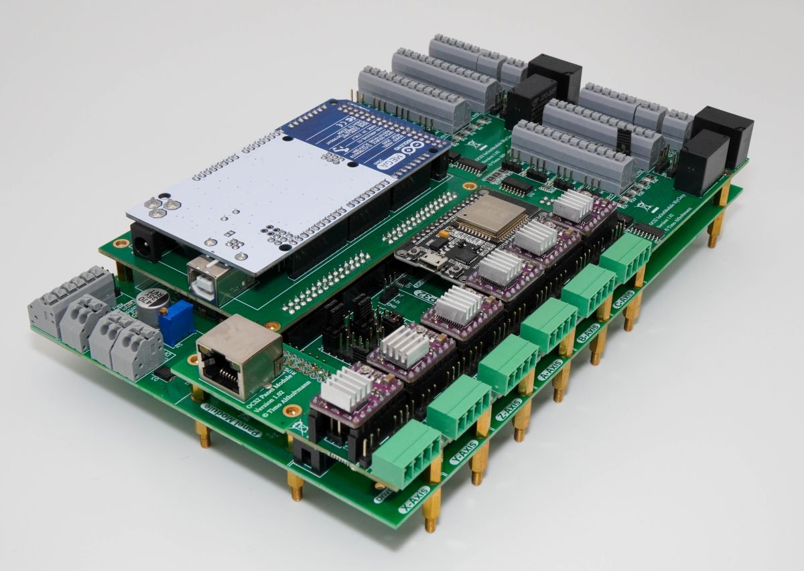

# Estlcam

<figure><figcaption></figcaption></figure>

 

<figure><figcaption></figcaption></figure>

 

<figure><figcaption>
OPEN-CNC-Shield 2 mit Estlcam ControllerModule und Arduino
</figcaption></figure>

Dieser Controller ist für die Verwendung der Software [Estlcam ](https://www.estlcam.de/Fertigungsunterlagen\_Klemmen.php)gedacht. Die Software wird von Christian Knüll entwickelt und deckt die Bedürfnisse im Hobby-Bereich sehr gut ab. Es wird außerdem ein Arduino Mega 2560 benötigt. Dieser wird auf das ControllerModule aufgesteckt.

Videoanleitung OPEN-CNC-Shield 2 - Estlcam:



### Überblick

* 3-Achsen
* CAM und Steuersoftware in einem
* 16 Eingänge
* 8 Ausgänge
* Zusätzliche Eingänge für Bedienelemente, Handrad, Joystick etc.
* Verbindung mit dem PC über USB

### Unterstützung der OCS2 Funktionen

<table><thead><tr><th width="313">Möglichkeiten OCS2</th><th width="432">Unterstützung des Estlcam Adapters</th></tr></thead><tbody><tr><td>6 Achsen</td><td>⚠️ Steuerung von 3 Achsen. Weitere Achsen können auf dem <a href="../mainboard-mini/anschluesse-jumper.md#achsenkonfiguration">Shield gleichlaufend konfiguriert </a>werden.</td></tr><tr><td>16 Eingänge</td><td>✅ 16 </td></tr><tr><td>8 Ausgänge</td><td>✅ 8</td></tr><tr><td>Spindelgeschwindigkeitssteuerung 0-5V, 0-10V oder 5V PWM</td><td>✅</td></tr><tr><td>Spindel An/Aus Anschluss zum Schalten eines Relais / Frequenzumrichters</td><td>✅</td></tr><tr><td><strong>Externe Bedienelemente</strong></td><td></td></tr><tr><td>Handrad / Encoder</td><td>✅</td></tr><tr><td>Motor Start Taster</td><td>✅</td></tr><tr><td>Programm Start Taster</td><td>✅</td></tr><tr><td>OK Taster</td><td>✅</td></tr><tr><td>Feedrate (Vorschubgeschwindigkeit)</td><td>✅</td></tr><tr><td>Rotation Speed (Spindelgeschwindigkeit)</td><td>✅</td></tr><tr><td>3-Achsen Joystick </td><td>✅</td></tr><tr><td>Auwahl X, Y, Z zur Wahl der Achsen für den Encoder</td><td>✅ <em><mark style="color:red;">Wird von Estlcam v12 nicht mehr unterstützt</mark></em></td></tr><tr><td>Speed 1 und Speed 2 zur Einstellung der Encoder Geschwindigkeit</td><td>✅ <em><mark style="color:red;">Wird von Estlcam v12 nicht mehr unterstützt</mark></em></td></tr></tbody></table>

### Pin Mapping

Die Pins sind nach dem originalen Estlcam Schema angeschlossen und können auch nicht verändert werden.

<figure><figcaption></figcaption></figure>

Pins, welche auf dem OCS2 nicht genutzt werden, stehen auf dem Adapter als Pinout zur Verfügung. Dazu gehören:

* Speed 3-6 _<mark style="color:red;">Wird von Estlcam v12 nicht mehr unterstützt</mark>_
* Motor Stop (Funktion ist auch durch zweimaliges Auslösen von Motor Start verfügbar)
* Programm Stop (Funktion ist auch durch zweimaliges Auslösen von Programm Start verfügbar)
* LED X, Y, Z _<mark style="color:red;">Wird von Estlcam v12 nicht mehr unterstützt</mark>_

### Technische Details

Die schematischen Zeichnungen und DXF files zu der Platine sind auf Github zu finden:

{% embed url="https://github.com/timo1235/cnc-werkstatt/tree/master/OPEN-CNC-Shield%202.x/OCS2%20modules/ControllerModules/ControllerModule%20Estlcam" %}
