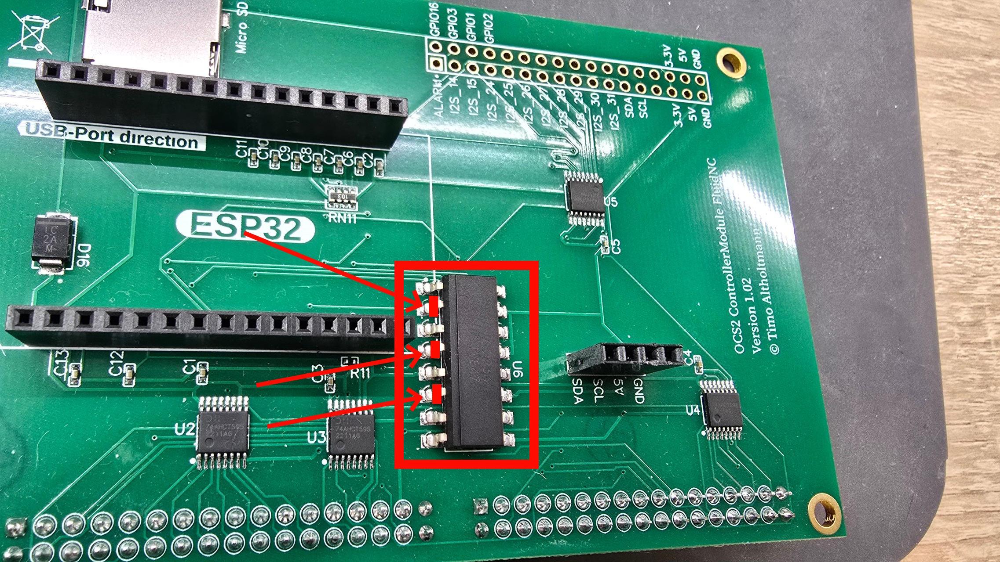
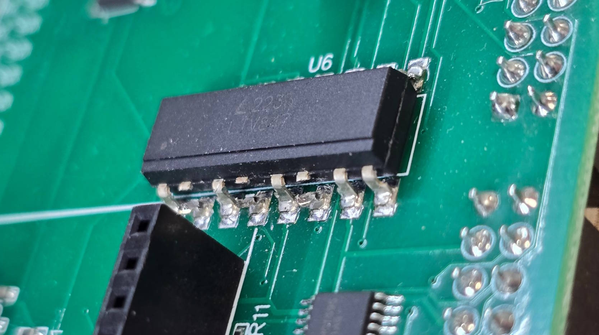

# Fehlerbehebung Eingänge bei FluidNC PCB ≤ 1.3 mit DualAdapter

### Fehlerbeschreibung

Bei FluidNC ControllerModules mit einer PCB-Version **≤ 1.3** sind die Eingänge **Motor Start, Programm Start und OK** in Verbindung mit dem Wireless Handwheel nicht funktionsfähig.\
Wird zusätzlich ein **DualAdapter** verwendet, sind diese Eingänge auch an dem anderem ControllerModule nicht funktional.

### Wann ist dieser Eingriff notwendig?

* **Nur bei FluidNC ControllerModules mit PCB-Version 1.3 oder niedriger**
* **Nur wenn ein DualAdapter eingesetzt wird**
* **Nur wenn die Eingänge (Motor Start, Programm Start, OK) an einem anderen ControllerModule genutzt werden sollen**


**Hinweis:** Es handelt sich um einen destruktiven Eingriff. Die Verbindung kann nur durch **Nachlöten** wiederhergestellt werden.


### Vorgehen

1. ControllerModule spannungsfrei schalten und sicherstellen, dass keine Versorgungsspannung anliegt.
2. Mit einer feinen/spitzen Zange die im Bild markierten Beinchen des **Optokopplers für die Eingänge** vorsichtig durchtrennen. **Alternativ kann auch der ganze Optokoppler (mit einer Heißluftstation) entfernt werden.**&#x20;
3. Nach dem Durchtrennen ist die Funktion der Eingänge auf diesem Modul deaktiviert, andere ControllerModules am DualAdapter können sie nun nutzen.

<figure><figcaption></figcaption></figure> <figure><figcaption></figcaption></figure>

