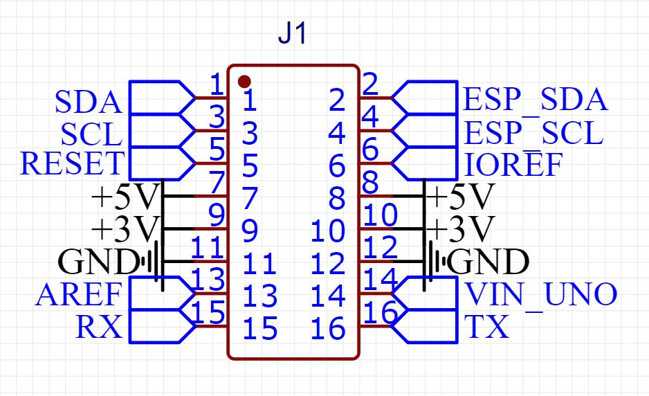

# GRBL Arduino Uno

Dieser Controller ist für die Verwendung von GRBL gedacht. Es wird zusätzlich ein Arduino Uno benötigt. Als Steuerungssoftware kommen sämtliche Softwares mit GRBL Unterstützung infrage, zum Beispiel [LaserGRBL](https://lasergrbl.com/).

### Überblick

* 3-Achsen
* 5 Eingänge
* 2 Ausgänge
* Zusätzliche Eingänge zum Starten des Programms etc.
* Verbindung mit dem PC über USB

### Unterstützung der OCS2 Funktionen <a href="#unterstuetzung-des-ocs2-funktionen" id="unterstuetzung-des-ocs2-funktionen"></a>

<table><thead><tr><th width="313">Möglichkeiten OCS2</th><th width="432">Unterstützung des Estlcam Adapters</th></tr></thead><tbody><tr><td>6 Achsen</td><td><span data-gb-custom-inline data-tag="emoji" data-code="26a0">⚠</span> Steuerung von 3 Achsen. Weitere Achsen können auf dem <a href="../../mainboard/anschluesse-jumper.md#achsenkonfiguration">Shield gleichlaufend konfiguriert </a>werden.</td></tr><tr><td>16 Eingänge</td><td><span data-gb-custom-inline data-tag="emoji" data-code="26a0">⚠</span> 5 - Verwendet für Limit X,Y und Z, Feed Hold und Probe Input aus GRBL</td></tr><tr><td>8 Ausgänge</td><td><span data-gb-custom-inline data-tag="emoji" data-code="26a0">⚠</span> 2 - Verwendet für Flood und Mist aus GRBL</td></tr><tr><td>Spindelgeschwindigkeitssteuerung 0-5V, 0-10V oder 5V PWM</td><td><span data-gb-custom-inline data-tag="emoji" data-code="2705">✅</span></td></tr><tr><td>Spindel An/Aus Anschluss zum Schalten eines Relais / Frequenzumrichters</td><td><span data-gb-custom-inline data-tag="emoji" data-code="2705">✅</span></td></tr><tr><td><strong>Externe Bedienelemente</strong></td><td></td></tr><tr><td>Handrad / Encoder</td><td><span data-gb-custom-inline data-tag="emoji" data-code="274c">❌</span></td></tr><tr><td>Motor Start Taster</td><td><span data-gb-custom-inline data-tag="emoji" data-code="274c">❌</span></td></tr><tr><td>Programm Start Taster</td><td><span data-gb-custom-inline data-tag="emoji" data-code="2705">✅</span> (GRBL "cycle start")</td></tr><tr><td>OK Taster</td><td><span data-gb-custom-inline data-tag="emoji" data-code="26a0">⚠</span> Genutzt für GRBL "reset"</td></tr><tr><td>Feedrate (Vorschubgeschwindigkeit)</td><td><span data-gb-custom-inline data-tag="emoji" data-code="274c">❌</span></td></tr><tr><td>Rotation Speed (Spindelgeschwindigkeit)</td><td><span data-gb-custom-inline data-tag="emoji" data-code="274c">❌</span></td></tr><tr><td>3-Achsen Joystick </td><td><span data-gb-custom-inline data-tag="emoji" data-code="274c">❌</span></td></tr><tr><td>Auwahl X, Y, Z zur Wahl der Achsen für den Encoder</td><td><span data-gb-custom-inline data-tag="emoji" data-code="274c">❌</span></td></tr><tr><td>Speed 1 und Speed 2 zur Einstellung der Encoder Geschwindigkeit</td><td><span data-gb-custom-inline data-tag="emoji" data-code="274c">❌</span></td></tr></tbody></table>

### Pin Mapping <a href="#undefined" id="undefined"></a>

| GRBL Funktion                    | OCS2 Anschluss                                                                                     |
| -------------------------------- | -------------------------------------------------------------------------------------------------- |
| X-Limit                          | Eingang 1                                                                                          |
| Y-Limit                          | Eingang 2                                                                                          |
| Z-Limit                          | Eingang 3                                                                                          |
| Spindle Enable                   | Spindle on/off                                                                                     |
| Spindle                          | Spindle pwm                                                                                        |
| Spindle Direction/Spindle Enable | Spindle on/off                                                                                     |
| Flood                            | Ausgang 2                                                                                          |
| Mist                             | Ausgang 1                                                                                          |
| Reset                            | OK                                                                                                 |
| Feed hold                        | Eingang 4 :warning: GRBL bedingt geteilt mit Safety Door                                           |
| Cycle Start                      | Programm Start                                                                                     |
| Safety Door                      | Eingang 4 :warning:GRBL bedingt geteilt mit Feed Hold                                              |
| Probe input                      | Eingang 5                                                                                          |
| Driver Enable / Disable          | ENA - Enable (:warning: nur wenn der Jumper JP1 gesteckt ist - siehe info Kommentar unter Tabelle) |


Die ENA Verbindung ist über einen Jumper vorgesehen. Das hat den Grund, dass einige Softwares(zum Beispiel LaserGRBL) die Treiber nur aktivieren, wenn auch verfahren wird. Demnach haben die Motoren dann im Stillstand keinen Haltemoment. Je nach Konstruktion/CNC kann das aber Probleme bereiten. Daher kann über den Jumper eingestellt werden, ob ENA von der Software verwaltet werden kann, oder nicht.


Für ungenutzte Pins und weitere Funktionen steht ein Pinout zur Verfügung:

<figure><figcaption></figcaption></figure>

### Technische Details

Die schematischen Zeichnungen und DXF files zu der Platine sind auf Github zu finden:

{% embed url="https://github.com/timo1235/cnc-werkstatt/tree/master/OPEN-CNC-Shield%202.x/OCS2%20modules/ControllerModules/ControllerModule%20GRBL%20Uno" %}

### Software

Damit alle Funktionen vorhanden sind, muss die Konfiguration von GRBL ein wenig angepasst werden. Dort sind einige Funktionen standardmäßig deaktiviert, welche wir aber nutzen können.

Dazu folgende Werte in der `config.h` im `grbl` Ordner folgendermaßen anpassen:

```clike
// Hiermit kann auch Mist geschaltet werden(Ausgang 1 am OPEN-CNC-Shield 2)
// vorher
// #define ENABLE_M7 // Disabled by default. Uncomment to enable.
// nachher
#define ENABLE_M7 // Disabled by default. Uncomment to enable.


// Hiermit funktioniert da schalten des spindel an/aus Ausgangs am OPEN-CNC-Shield 2
// vorher 
// #define USE_SPINDLE_DIR_AS_ENABLE_PIN // Default disabled. Uncomment to enable.
// nachher 
#define USE_SPINDLE_DIR_AS_ENABLE_PIN // Default disabled. Uncomment to enable.
```

