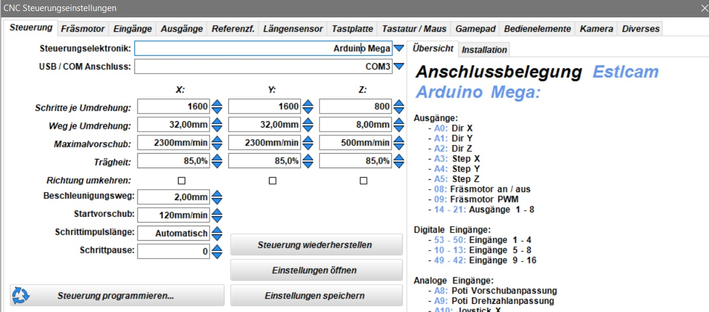

# Pololu - Aufstecktreiber

<figure><figcaption></figcaption></figure> <figure><figcaption></figcaption></figure>

Mit diesem DriverModule können Aufstecktreiber verwendet werden. Es funktionieren alle Treiber mit einem Pololu Pinout. Darunter fallen zum Beispiel DRV8825 oder A4988.&#x20;

### Überblick

* Motoranschluss über Pin Header oder 4-Pol. Schraubstecker
* Microstepping-Einstellung über Jumper

### Pinout **/ Anschluss**

<figure><figcaption></figcaption></figure>


Manchmal sind die Anschlüsse anders beschriftet. Es kann auch sein, dass die Bezeichnung 1A und 1B für eine Wicklung bzw. 2A und 2B verwendet wird.


#### Aufstecktreiber

Der Aufstecktreiber wird einfach in die beiden Pin-Leisten eingesteckt. Die Ausrichtung spielt hierbei eine große Rolle. Zur Orientierung habe ich oben die Position der Motoranschlüsse weiß umrandet. **Diese muss mit der Position der Motoranschlüsse auf dem Treiber übereinstimmen.**

#### Stepper Motor

Der Stepper Motor kann entweder über den Pin Header angeschlossen werden, oder über den Schraubstecker. Die Reihenfolge der Anschlüsse bleibt hierbei gleich: A2, A1, B1, B2

Die Anschlüsse A1 und A2 sowie B1 und B2 stellen jeweils eine Wicklung der Stepper Motors dar. Um herauszufinden, welche Kabel zusammengehören, kann man eine Durchgangsmessung machen. Die Anschlüsse A1 und A2 sollten einen Durchgang haben. Genauso wie B1 und B2.

### FLT Jumper

Der FLT Jumper JP1 kann/muss je nach verwendetem Treiber gesetzt werden:

* **DRV8825:** Der Jumper **kann** in die rechte Position (auf ALARM) gesteckt werden. Dann ist der "Fault" Ausgang der DRV8825 mit ALARM des OPEN-CNC-Shield 2 verbunden und löst bei Überlast am Treiber aus.&#x20;
* **A4988**: Der Jumper **muss** in die linke Position (auf 5V) gesteckt werden. Ansonsten funktionieren die Treiber nicht

### Microstepping

Das Microstepping kann sich von Treiber zu Treiber unterscheiden. **Im Folgenden beziehe ich mich auf DRV8825 Aufstecktreiber.**

Das Microstepping der Aufstecktreiber wird mit Jumpern eingestellt. Diese befinden sich auf der Platin&#x65;**,** genau unter den jeweiligen Treibern. Diese Einstellung kann demnach nur erfolgen, wenn die Treiber nicht eingesteckt sind.

Mit Microstepping kann man die Schritte des Motors weiter verkleinern. Ein typischer Schrittmotor hat z.B. 200 Schritte für eine volle Umdrehung. Stellt man das Mircostepping nun etwa auf 1/8 Schritt bedeutet dies: 200 × 8 = 1600 – Es werden nun 1600 Schritte für eine volle Drehung benötigt. Je höher die Microstepping Einstellung, desto geringer wird der Haltemoment der Motoren. Generell kann man mit diesen Werten experimentieren, um zu schauen, welche sich am besten für die eigene Maschine eignen. Oft geben Hersteller auch an, wie die Mikroschritte eingestellt werden sollten. Hat man hier eine Einstellung gewählt, muss man diese auch unbedingt der Software mitteilen.

| MS0 | MS1 | MS2 | Schritte        |
| --- | --- | --- | --------------- |
| 0   | 0   | 0   | 1 - Vollschritt |
| 1   | 0   | 0   | 1/2 Schritt     |
| 0   | 1   | 0   | 1/4 Schritt     |
| 1   | 1   | 0   | 1/8 Schritt     |
| 0   | 0   | 1   | 1/16 Schritt    |
| 1   | 0   | 1   | 1/32 Schritt    |
| 0   | 1   | 1   | 1/32 Schritt    |
| 1   | 1   | 1   | 1/32 Schritt    |


0 bedeutet Jumper ist nicht gesetzt, 1 bedeutet Jumper ist gesetzt


<figure><figcaption></figcaption></figure>

Hier ist ein Beispiel für Estlcam. Die Mikroschritte sollten so für eine MPCNC-Fräse funktionieren. Die Jumper sind in diesem Beispiel für die x- und y-Achse auf 1/8 Schritt und für die z-Achse auf 1/4 Schritt eingestellt.

### Treiberstrom einstellen

Die Treiber verfügen über ein Potentiometer, mit dem der Strom oder die Spannung eingestellt werden kann. Die richtige Spannungseinstellung für den Treiber hängt von verschiedenen Faktoren ab, einschließlich des verwendeten Treibers (DRV8825/A4988/TMC2209 usw.) und des auf dem Treiber installierten Widerstands. Das Datenblatt des Treibers ist eine nützliche Ressource für diese Einstellung.

Die Spannungseinstellung sollte im eingeschalteten Zustand vorgenommen werden, daher ist äußerste Vorsicht geboten, um ein Abrutschen und möglichen Kurzschluss zu vermeiden. In dem folgenden Video zeige ich kurz, wie die Motoren eingestellt werden können. In dem Video wird zwar das OPEN-CNC-Shield 1 verwendet, das Vorgehen bleibt aber gleich.



### TMC2209 mit UART - Sensorless homing

Aktuell gibt es leider kein DriverModule, welches die UART-Pins herausführt, damit diese zum Beispiel mit FluidNC genutzt werden können.&#x20;

### Technische Details

Die schematischen Zeichnungen und DXF files zu der Platine sind auf Github zu finden:

{% embed url="https://github.com/timo1235/cnc-werkstatt/tree/master/OPEN-CNC-Shield%202.x/OCS2%20modules/DriverModules/DriverModule%20Pluggable" %}

### Zubehör

| Bild                                                     | Beschreibung                                                                                              | Link                                                     |
| -------------------------------------------------------- | --------------------------------------------------------------------------------------------------------- | -------------------------------------------------------- |
|  | Lüfterhalter für einen 120 mm x 120 mm Lüfter. Wird auf die Abstandsbolzen der DriverModules aufgesteckt. | [Thingiverse](https://www.thingiverse.com/thing:5643127) |
