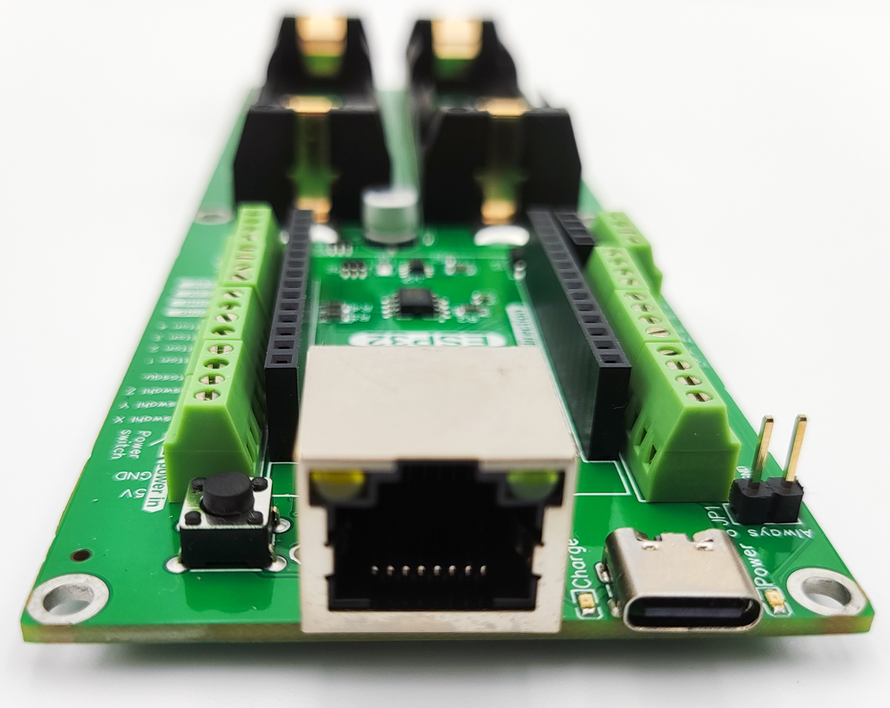
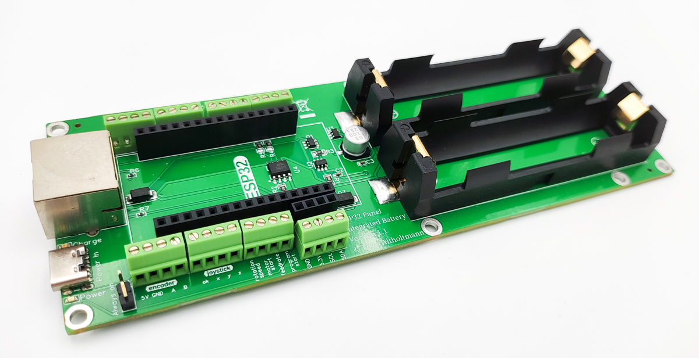

# ESP32 Panel Integrated Battery Platine

<figure><figcaption></figcaption></figure>

 

<figure><figcaption></figcaption></figure>

 

<figure><figcaption></figcaption></figure>

Die ESP32 Panel Integrated Battery Platine ist für den Bau externer Bedienelemente gedacht. Der ESP32 auf der Platine kommuniziert dabei über WiFi mit dem OPEN-CNC-Shield 2. Der Funktionsumfang ist dabei auf die Verwendung mit dem Estlcam ControllerModule zugeschnitten. Wird ein anderer Controller genutzt, kann der Funktionsumfang stark eingeschränkt sein. Dazu bitte die Dokumentation der einzelnen ControllerModule beachten.

### Überblick

* WiFi kommunikation - 2,4GHz - ESPNOW Protokoll
* Stromversorgung über RJ45 oder USB-C&#x20;
* Eigene Signalleitung für den Encoder im RJ45 Kabel (das Encoder Signal wird nicht per WiFi übertragen)
* Stromversorgung durch 2 x 18650 Batterien möglich
* Ladeelektronik mit Sicherheitsabschaltung für die 18650 Batterien
  * Tiefenentladungsschutz und Überladungsschutz
* Laden der Batterien durch RJ45-Verbindung zum OCS2 oder mit einem USB Charger an dem USB-C Anschluss
* Verschiedene, optionale Anschlussmöglichkeiten:
  * 4Pin - 5V Encoder
  * Joystick mit 3 Achsen und OK-Taster (zum Abnullen der Achsen)
  * Motor Start/Stop Taster
  * Programm Start/Stop Taster
  * Feedrate Poti (Vorschubgeschwindigkeit)
  * Rotation Speed Poti (Spindelgeschwindigkeit)
  * Autosquare Taster
  * Auswahl X, Y und Z (zur Auswahl der Achse für den Encoder)
  * 4 freie Buttons (kann zum Beispiel für die Stromlos-Funktion oder Speed1, Speed2 genutzt werden. Es können auch die Outputs 1-4 des OPEN-CNC-Shields 2 geschaltet werden)
  * Anschluss für I2C, typischerweise für ein Display

### Technische Details

| Eigenschaft       | Wert / Beschreibung                            |
| ----------------- | ---------------------------------------------- |
| Maße              | 160 mm x 56 mm x 19 mm(mit ESP32 bestückt)     |
| Digitale Eingänge | Interne Pullups - Schalten im Standard mit GND |
| Analoge Eingänge  | Spannung von 0-3,3V                            |

Schematische Darstellung und DXF Dateien zu der Platine sind auf Github zu finden:&#x20;

{% embed url="https://github.com/timo1235/cnc-werkstatt/tree/master/OPEN-CNC-Shield%202.x/ESP32%20Panel%20PCB" %}

#### Stromversorgung

| Szenario                                                                               | Beschreibung                                                                                                                                                                                                     |
| -------------------------------------------------------------------------------------- | ---------------------------------------------------------------------------------------------------------------------------------------------------------------------------------------------------------------- |
| 
Szenario 1: RJ45 Verbindung zum OCS2 oder Anschluss von einem  USB-C Charger
 | Die 18650 Batterien werden geladen. Ist eine dauerhafte Kabelverbindung vorgesehen, kann der Jumper JP1 gesetzt werden. Die Platine ist dann immer eingeschaltet und benötigt keinen separaten Ein-/Ausschalter. |

### Jumper

|     |                                                                                                                                                                           |
| --- | ------------------------------------------------------------------------------------------------------------------------------------------------------------------------- |
| JP1 | Dieser Jumper überbrückt den An/Aus Schalter. Wenn kein Schalter eingebaut wird, kann dieser Jumper gesetzt werden. Dann ist das Bedienteil immer an, wenn Strom anliegt. |

### Software / Firmware

Die Firmware kann auf Github heruntergeladen werden:&#x20;



Die Einstellungen können bequem über ein Webinterface vorgenommen werden.

### Anschluss Schema

Diese schematische Darstellung soll als Hilfe zum Anschließen der einzelnen Bedienelemente dienen. Für eine besser Auflösung, die PDF nutzen.

Das Schema zeigt die baugleiche ESP32 Panel Platine und kann für die Integrated Battery Platine wiederverwendet werden. Es wurden lediglich die Powerbank Anschlüsse durch zwei 18650 Batterien getauscht.

#### Bild

<figure><figcaption></figcaption></figure>

#### PDF (bessere Qualität)



### Beispiel Projekte

| Bild                                                                             | Beschreibung                                  | Links                                                                                                                                                                                                                                                                                                                    |
| -------------------------------------------------------------------------------- | --------------------------------------------- | ------------------------------------------------------------------------------------------------------------------------------------------------------------------------------------------------------------------------------------------------------------------------------------------------------------------------ |
|  | Handrad mit Powerbank                         | <ul><li><a href="https://blog.altholtmann.com/cnc-handrad-open-cnc-shield-2/">Blog Post mit Anleitung</a></li><li><a href="https://www.thingiverse.com/thing:5641305">Thingiverse</a></li></ul>                                                                                                                          |
|                | Handrad mit Powerbank und ColdEnd32 Elementen | <ul><li><a href="https://www.thingiverse.com/thing:6033990">Thingiverse</a></li><li><a href="https://www.printables.com/model/489073-handwheel-estlcam-coldend-ocs2-wifi">Printables</a></li><li><a href="https://blog.altholtmann.com/esp32-wifi-panel-ocs2-estlcam-coldend/">Blog Post mit Informationen</a></li></ul> |
