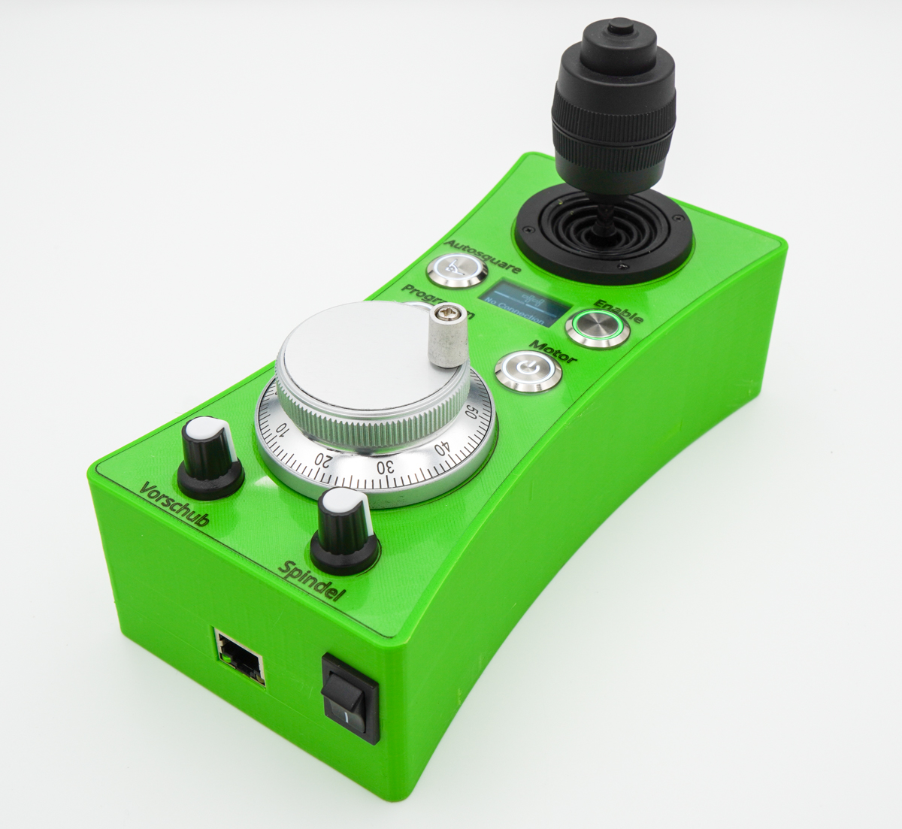

# ESP32 Panel Platine

<figure><figcaption></figcaption></figure>

 

<figure><figcaption></figcaption></figure>

 

<figure><figcaption></figcaption></figure>

 

<figure><figcaption></figcaption></figure>

Die ESP32 Panel Platine ist für den Bau externer Bedienelemente gedacht. Der ESP32 auf der Platine kommuniziert dabei über WiFi mit dem OPEN-CNC-Shield 2. Der Funktionsumfang ist dabei auf die Verwendung mit dem Estlcam ControllerModule zugeschnitten. Wird ein anderer Controller genutzt, kann der Funktionsumfang stark eingeschränkt sein. Dazu bitte die Dokumentation der einzelnen ControllerModule beachten.

### Überblick

* WiFi kommunikation - 2,4GHz - ESPNOW Protokoll
* Stromversorgung über RJ45
* Eigene Signalleitung für den Encoder im RJ45 Kabel (das Encoder Signal wird nicht per WiFi übertragen)
* Stromversorgung durch Powerbank möglich
* Laden der Powerbank möglich (mit RJ45 Verbindung zum OPEN-CNC-Shield 2)
* Verschiedene, optionale Anschlussmöglichkeiten:
  * 4Pin - 5V Encoder
  * Joystick mit 3 Achsen und OK-Taster (zum Abnullen der Achsen)
  * Motor Start/Stop Taster
  * Programm Start/Stop Taster
  * Feedrate Poti (Vorschubgeschwindigkeit)
  * Rotation Speed Poti (Spindelgeschwindigkeit)
  * Autosquare Taster
  * Auswahl X, Y und Z (zur Auswahl der Achse für den Encoder)
  * 4 freie Buttons (kann zum Beispiel für die Stromlos-Funktion oder Speed1, Speed2 genutzt werden. Es können auch die Outputs 1-4 des OPEN-CNC-Shields 2 geschaltet werden)
  * Anschluss für I2C, typischerweise für ein Display

### Technische Details

| Eigenschaft       | Wert / Beschreibung                            |
| ----------------- | ---------------------------------------------- |
| Maße              | 65 mm x 56 mm x 19 mm(mit ESP32 bestückt)      |
| Digitale Eingänge | Interne Pullups - Schalten im Standard mit GND |
| Analoge Eingänge  | Spannung von 0-3,3V                            |

Schematische Darstellung und DXF Dateien zu der Platine sind auf Github zu finden:&#x20;

{% embed url="https://github.com/timo1235/cnc-werkstatt/tree/master/OPEN-CNC-Shield%202.x/ESP32%20Panel%20PCB" %}

#### Stromversorgung

| Szenario                                                   | Beschreibung                                                                             |
| ---------------------------------------------------------- | ---------------------------------------------------------------------------------------- |
| 
Szenario 1: RJ45 Kabel zum OCS2 oder USB-C Kabel
 | Jumper JP1 kann gesetzt werden. Das Bedienteil ist dann immer an, wenn Strom da ist      |
| 
Szenario 2: 18650 Batterien sind installiert
     | Keine Jumper setzen. Ein-/Ausschalter verwenden. Laden der Batterien per RJ45 oder USB-C |

### Jumper

|     |                                                                                                                                                                                       |
| --- | ------------------------------------------------------------------------------------------------------------------------------------------------------------------------------------- |
| JP1 | Dieser Jumper überbrückt den Ein-/Ausschalter. Ist der Jumper gesetzt, ist die Platine immer an, wenn Strom anliegt. Sei es aus der Batterie, dem RJ45 Kabel oder dem USB-C Anschluss |

### Software / Firmware

Die Firmware kann auf Github heruntergeladen werden:&#x20;



Die Einstellungen können bequem über ein Webinterface vorgenommen werden.

### Anschluss Schema

Diese schematische Darstellung soll als Hilfe zum Anschließen der einzelnen Bedienelemente dienen. Für eine besser Auflösung, die PDF nutzen. Das ESP32 Panel Integrated Battery ist baugleich zum ESP32 Panel. Der einzige Unterschied ist, dass statt der Powerbank zwei 18650 Batterien verwendet werden können. Daher kann das untenstehende Schema hier ebenfalls verwendet werden.

#### Bild

<figure><figcaption></figcaption></figure>

#### PDF (bessere Qualität)



### Beispiel Projekte

| Bild                                                                             | Beschreibung                                  | Links                                                                                                                                                                                                                                                                                                                    |
| -------------------------------------------------------------------------------- | --------------------------------------------- | ------------------------------------------------------------------------------------------------------------------------------------------------------------------------------------------------------------------------------------------------------------------------------------------------------------------------ |
|  | Handrad mit Powerbank                         | <ul><li><a href="https://blog.altholtmann.com/cnc-handrad-open-cnc-shield-2/">Blog Post mit Anleitung</a></li><li><a href="https://www.thingiverse.com/thing:5641305">Thingiverse</a></li></ul>                                                                                                                          |
|                | Handrad mit Powerbank und ColdEnd32 Elementen | <ul><li><a href="https://www.thingiverse.com/thing:6033990">Thingiverse</a></li><li><a href="https://www.printables.com/model/489073-handwheel-estlcam-coldend-ocs2-wifi">Printables</a></li><li><a href="https://blog.altholtmann.com/esp32-wifi-panel-ocs2-estlcam-coldend/">Blog Post mit Informationen</a></li></ul> |
