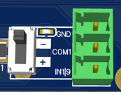

# Ein- und Ausgänge nutzen

Es gibt auf dem OPEN-CNC-Shield 2 generell 16 Eingänge und 8 Ausgänge. Um diese zu nutzen, sollten die entsprechenden InOutModule genutzt werden. Es können zwei dieser Module auf dem Mainboard verbaut werden. Jedes Modul hat demnach 8 Eingänge und 4 Ausgänge. Die verschiedenen InOutModule unterscheiden sich hauptsächlich in der Art der Anschlüsse, die Funktion ist aber gleich. Daher kann die folgende Dokumentation für alle InOutModules genutzt werden.

## Eingänge

<figure><figcaption></figcaption></figure>

Die Eingänge sehen alle etwa so aus. Es gibt die Anschlüsse GND, COM1 und IN(1-16). Dann gibt es noch einen Switch oder Jumper mit den Positionen (+) und (-). Der Switch oder Jumper steuert, was an IN1-16 anliegen muss, damit ein Signal erkannt wird.&#x20;

* Jumper in (+) Position: Ein Signal wird erkannt, wenn an IN1-16 eine Spannung zwischen 5 und 24V anliegt.&#x20;
* Jumper in (-) Position: Ein Signal wird erkannt, wenn an IN1-16 GND(Masse) anliegt.

COM1 und GND sind nur zusätzliche Anschlüsse, sind aber nicht notwendig für den Eingang. NPN bzw. PNP Sensoren benötigen zum Beispiel Strom. Dieser kann an COM1 und GND abgenommen werden. Dazu kann an COM1 mit einem Jumper auf der Platine die gewünschte Spannung eingestellt werden.&#x20;

### **NC(normally closed) oder NO(normally open)**

Es können entweder normally closed (im Normalzustand geschlossen / ausgelöst) oder normally open (im Normalzustand geöffnet / nicht ausgelöst) Endstopps angeschlossen werden. Diese können entweder mit mehreren an einem Eingang angeschlossen werden oder es kann jeder Endstopp an seinen eigenen Eingang angeschlossen werden.\
Ich würde eine normally closed Verkabelung bevorzugen, da hierbei auch Kabelbrüche direkt erkannt werden können. Eingänge, an denen normally closed Sensoren angebracht sind, müssen in der Software vermutlich invertiert werden.

### NPN / PNP

<figure><figcaption></figcaption></figure>

Es können sowohl PNP Sensoren als auch NPN Sensoren angeschlossen werden. Hierzu muss lediglich die passende Switch-/Jumpereinstellung an dem Eingang vorgenommen werden. Diese gibt es ebenfalls als NC(normally closed) oder NO(normally open) Variante.

_NPN Sensoren verhalten sich "merkwürdig" und schalten nicht, wie sie sollten? Siehe dazu die Informationen in diesem Github Issue:_ [_https://github.com/timo1235/cnc-werkstatt/issues/5_](https://github.com/timo1235/cnc-werkstatt/issues/5)

### Tastplatte

Falls z.B. eine China Spindle eingesetzt wird, kann man das Gehäuse der Spindel mit GND verbinden und die Tastplatte dann mit nur einem Kabel mit IN1-16 verbinden.  Üblicherweise ist die Spindel geerdet und man verbindet im Schaltkasten GND mit der Erde. Sobald die Spindel nun die Tastplatte berührt, liegt GND an IN1-16 an und der Eingang löst aus. Der Switch/Jumper muss hierfür in der (-) Position stehen.

### Beispiele

<figure><figcaption>
Endstop als NC(normally closed) - geschaltet mit GND
</figcaption></figure>

<figure><figcaption>
NPN Sensor - für PNP den Jumper in (+) Stellung bringen.
</figcaption></figure>

## Ausgänge

<figure><figcaption></figcaption></figure>

Die Ausgänge haben 3 Anschlüsse - GND, OUT1-8 und COM2.

Auch hier ist der einzig relevante Anschluss OUT1-8. GND und COM2 sind lediglich zusätzliche Anschlüsse welche genutzt werden können.&#x20;

**Zu beachten ist, dass OUT1-8 = GND ist, wenn geschaltet. Demnach wird ein Verbraucher(Relais) an OUT1-8(GND) und COM2(5-24V) angeschlossen.**

COM2 kann mit einem Jumper auf der Platine auf die gewünschte Spannung eingestellt werden.&#x20;

## COM Jumper / Spannung einstellen

Die COM-Anschlüsse für die Ein- und Ausgänge können auf der Platine mit einem Jumper eingestellt werden. Man hat hier die Möglichkeit zwischen 5V und der Boardspannung(VIN) welche normalerweise 24V ist.

**Wird der Jumper frei gelassen, kann auch eine eigene Spannung angelegt werden, z.B. von einem externen Netzteil.**  \
Beispiel: Es soll an COM1 12V anliegen. Dann nehmen wir ein externes 12V Netzteil, verbinden GND vom Netzteil mit GND des InOutModuls(egal an welchem Anschluss) und verbinden das 12V Kabel vom Netzteil mit COM1(der mittlere Pin an dem Einstellungsjumper oder an irgendeinem COM1 Anschluss auf der Platine). Danach liegt an COM1 überall 12V an.
