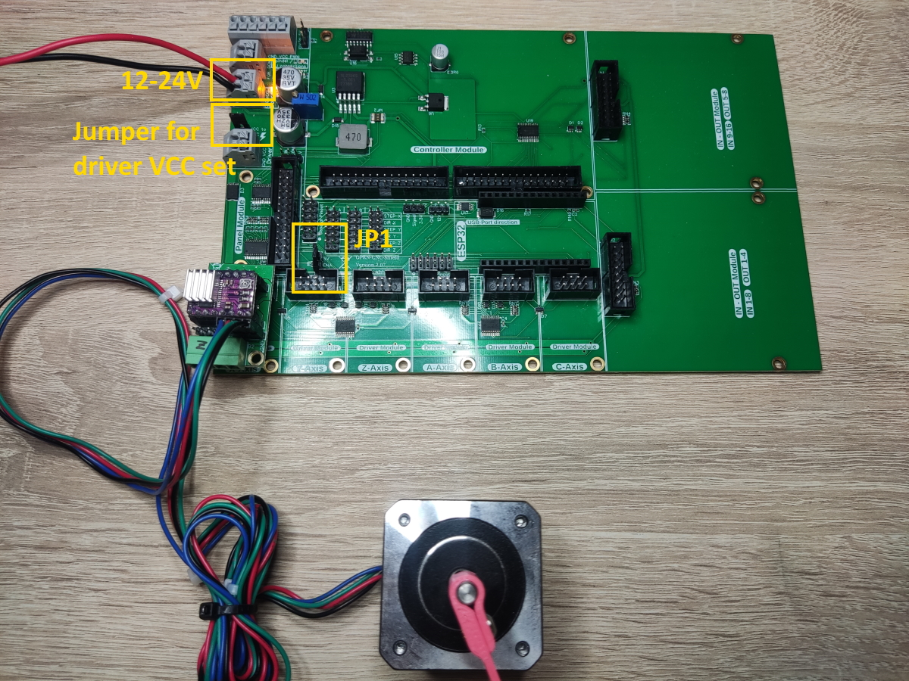

# Fehlersammlung

## Probleme

[#motoren-drehen-manchmal-in-die-falsche-richtung-beim-autosquaring.-motoren-fahren-gegen-ihre-endstop](fehlersammlung.md#motoren-drehen-manchmal-in-die-falsche-richtung-beim-autosquaring.-motoren-fahren-gegen-ihre-endstop "mention")

[#der-esp32-auf-dem-open-cnc-shield-2-blinkt-blau-im-serial-monitor-steht-pca9555\_1-not-found-oder-pca](fehlersammlung.md#der-esp32-auf-dem-open-cnc-shield-2-blinkt-blau-im-serial-monitor-steht-pca9555\_1-not-found-oder-pca "mention")

[#die-motoren-fahren-los-sobald-estlcam-gestartet-wird-auch-bei-mittelstellung-des-joysticks-bewegen-s](fehlersammlung.md#die-motoren-fahren-los-sobald-estlcam-gestartet-wird-auch-bei-mittelstellung-des-joysticks-bewegen-s "mention")

[#joystick-laesst-sich-nicht-mittig-einstellen-am-panelmodule-breakout](fehlersammlung.md#joystick-laesst-sich-nicht-mittig-einstellen-am-panelmodule-breakout "mention")

[#cnc-bewegt-sich-nicht-fraese-verfaehrt-nicht-motoren-stehen-still](fehlersammlung.md#cnc-bewegt-sich-nicht-fraese-verfaehrt-nicht-motoren-stehen-still "mention")

## Lösungen

### Motoren drehen manchmal in die falsche Richtung beim Autosquaring. Motoren fahren gegen ihre Endstops nach dem Autosquaring

Siehe diesen Beitrag: [autosquaring.md](autosquaring.md "mention"). Autosquaring sollte immer vor dem Start der Software ausgeführt werden, da diese ansonsten den Prozess beeinflussen kann.

### Der ESP32 auf dem OPEN-CNC-Shield 2 blinkt blau / Im Serial Monitor steht "PCA9555\_1 not found!!" oder "PCA9555\_2 not found!!"

Das deutet darauf hin, dass die beiden oder einer beiden PCA9555 Chips nicht gefunden wird. Diese Chips sind In-Out-Expander für den ESP32 und stelle zusätzliche In- und Outputs zur Verfügung.\
**Die Chips funktionieren nur, wenn auch Boardspannung anliegt**. Ein USB-Kabel am ESP32 oder dem Estlcam-Arduino reichen nicht aus. Wenn einer der Chips trotz passender Stromversorgung nicht gefunden wird, muss dieser ausgetauscht werden.

### Die Motoren fahren los, sobald Estlcam gestartet wird / Auch bei Mittelstellung des Joysticks bewegen sich die Motoren

Prüfen, ob die Achsen des Joysticks richtig kalibriert sind. Bei Estlcam -> Einstellungen -> CNC-Steuerung -> Bedienelemente kann der Joystick kontrolliert werden. Ist der Joystick in Mittelstellung, sollten auch dort die blauen Balken alle relativ mittig sein. Kleine Abweichungen sind normal und lassen sich in Estlcam über den "Leerweg" abfangen. Sollte die Abweichung zu groß sein, kann man einfach die Kalibrierung starten, falls man die ESP32 Panel Platine nutzt, siehe [esp32-panel-platine.md](../esp32-panel-platine.md "mention"). Diese kann den Joystick selbst kalibrieren.\
Ansonsten kann man die Potis direkt am Joystick einstellen. Dazu die kleine Schraube lösen und den Poti ein wenig drehen, bis der Ausschlag des Balkens in Estlcam nahezu mittig ist. Kleine Schwankungen wird es immer geben.&#x20;

### Joystick lässt sich nicht mittig einstellen am PanelModule Breakout

Das ist vermutlich auf ein Problem auf der Platine zurückzuführen. Siehe dazu [https://github.com/timo1235/cnc-werkstatt/issues/3](https://github.com/timo1235/cnc-werkstatt/issues/3)\
Die einfachste Lösung ist, einen ESP32 mit der OCS2 Firmware auf das OCS2 aufzustecken.

### CNC bewegt sich nicht / Fräse verfährt nicht / Motoren stehen still

Bei diesem Fehlerbild gehe ich immer folgendermaßen vor:

#### Motoren haben keinen Haltemoment

Das Haltemoment ist eine entscheidende Voraussetzung, damit Motoren in Bewegung treten können. Um dies zu überprüfen, ziehe ich zunächst das Controller-Modul und den ESP32 vom Mainboard ab, natürlich im stromlosen Zustand. Anschließend lege ich Strom auf das Mainboard und überprüfe das Haltemoment der Motoren. Falls kein Haltemoment vorhanden ist, teste ich den Jumper JP1 (ENA) in beiden Positionen, um herauszufinden, ob sich das Haltemoment einstellt.

Hier ein Bild zur Veranschaulichung des Testaufbaus:

<figure><figcaption></figcaption></figure>

Sollten die Motoren immer noch kein Haltemoment aufweisen, bleiben lediglich die Stromzufuhr und die Verkabelung der Motoren als mögliche Fehlerquellen übrig. Ist das Haltemoment jedoch gegeben, können das Controller-Modul und der ESP32 nacheinander wieder angeschlossen werden. Nach jedem Anschluss sollte erneut geprüft werden, ob das Haltemoment weiterhin vorhanden ist. Auf diese Weise kann der Fehler entweder auf den ESP32 oder den Controller eingegrenzt werden.

Falls der Fehler im Controller liegt, sollte die Dokumentation des Controllers sowie die zugehörige Software überprüft werden. Beispielsweise setzt GRBL die Motoren immer stromlos, wenn sie nicht verfahren. Liegt der Fehler hingegen im ESP32, sollten folgende Fragen geklärt werden: Ist die Software des ESP32 korrekt aufgespielt? In der Konfiguration der Software befindet sich ein Wert für den ENA-Status, welcher zur Überprüfung geändert werden könnte. Ist ein Funk-Handrad verbunden? Falls ja, könnte dort eventuell "ENA" ausgelöst sein.

#### Motoren haben Haltemoment

Wenn die Motoren Haltemoment haben, bleibt eigentlich nur die Verkabelung zu prüfen. Man könnte zum testen nur STEP und GND anschließen und schauen ob sich dann etwas bewegt, wenn in der Software verfahren wird.
