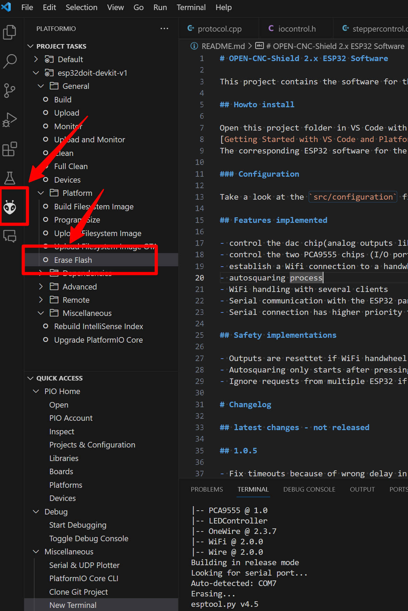

# Fehlersammlung

## Probleme

[#motoren-drehen-manchmal-in-die-falsche-richtung-beim-autosquaring.-motoren-fahren-gegen-ihre-endstop](fehlersammlung.md#motoren-drehen-manchmal-in-die-falsche-richtung-beim-autosquaring.-motoren-fahren-gegen-ihre-endstop "mention")

[#der-esp32-auf-dem-open-cnc-shield-2-blinkt-blau-im-serial-monitor-steht-pca9555\_1-not-found-oder-pca](fehlersammlung.md#der-esp32-auf-dem-open-cnc-shield-2-blinkt-blau-im-serial-monitor-steht-pca9555\_1-not-found-oder-pca "mention")

[#die-motoren-fahren-los-sobald-estlcam-gestartet-wird-auch-bei-mittelstellung-des-joysticks-bewegen-s](fehlersammlung.md#die-motoren-fahren-los-sobald-estlcam-gestartet-wird-auch-bei-mittelstellung-des-joysticks-bewegen-s "mention")

[#joystick-laesst-sich-nicht-mittig-einstellen-am-panelmodule-breakout](fehlersammlung.md#joystick-laesst-sich-nicht-mittig-einstellen-am-panelmodule-breakout "mention")

[#cnc-bewegt-sich-nicht-fraese-verfaehrt-nicht-motoren-stehen-still](fehlersammlung.md#cnc-bewegt-sich-nicht-fraese-verfaehrt-nicht-motoren-stehen-still "mention")

[#analoge-inputs-funktionieren-in-estlcam-mit-dem-esp32-panel-wifi-nicht-digitale-inputs-buttons-aber](fehlersammlung.md#analoge-inputs-funktionieren-in-estlcam-mit-dem-esp32-panel-wifi-nicht-digitale-inputs-buttons-aber "mention")

[#esp32-panel-software-erstellt-keinen-wlan-hotspot](fehlersammlung.md#esp32-panel-software-erstellt-keinen-wlan-hotspot "mention")

## Lösungen

### Motoren drehen manchmal in die falsche Richtung beim Autosquaring. Motoren fahren gegen ihre Endstops nach dem Autosquaring

Siehe diesen Beitrag: [autosquaring.md](autosquaring.md "mention").&#x20;

**Für PCB Version <2.12:** Autosquaring sollte immer vor dem Start der Software ausgeführt werden, da diese ansonsten den Prozess beeinflussen kann.

### Der ESP32 auf dem OPEN-CNC-Shield 2 blinkt blau / Im Serial Monitor steht "PCA9555\_1 not found!!" oder "PCA9555\_2 not found!!"

Das deutet darauf hin, dass die beiden oder einer beiden PCA9555 Chips nicht gefunden wird. Diese Chips sind In-Out-Expander für den ESP32 und stelle zusätzliche In- und Outputs zur Verfügung.\
**Die Chips funktionieren nur, wenn auch Boardspannung anliegt**. Ein USB-Kabel am ESP32 oder dem Estlcam-Arduino reichen nicht aus. Wenn einer der Chips trotz passender Stromversorgung nicht gefunden wird, muss dieser ausgetauscht werden.

### Die Motoren fahren los, sobald Estlcam gestartet wird / Auch bei Mittelstellung des Joysticks bewegen sich die Motoren

Prüfen, ob die Achsen des Joysticks richtig kalibriert sind. Bei Estlcam -> Einstellungen -> CNC-Steuerung -> Bedienelemente kann der Joystick kontrolliert werden. Ist der Joystick in Mittelstellung, sollten auch dort die blauen Balken alle relativ mittig sein. Kleine Abweichungen sind normal und lassen sich in Estlcam über den "Leerweg" abfangen. Sollte die Abweichung zu groß sein, kann man einfach die Kalibrierung starten, falls man die ESP32 Panel Platine nutzt, siehe [esp32-panel-platine.md](../esp32-panel/esp32-panel-platine.md "mention"). Diese kann den Joystick selbst kalibrieren.\
Ansonsten kann man die Potis direkt am Joystick einstellen. Dazu die kleine Schraube lösen und den Poti ein wenig drehen, bis der Ausschlag des Balkens in Estlcam nahezu mittig ist. Kleine Schwankungen wird es immer geben.&#x20;

### Joystick lässt sich nicht mittig einstellen am PanelModule Breakout

Das ist vermutlich auf ein Problem auf der Platine zurückzuführen. Siehe dazu [https://github.com/timo1235/cnc-werkstatt/issues/3](https://github.com/timo1235/cnc-werkstatt/issues/3)\
Die einfachste Lösung ist, einen ESP32 mit der OCS2 Firmware auf das OCS2 aufzustecken.


Ab PCB Version 2.12 ist dieses Verhalten korrigiert. Möchte man ein Bedienteil direkt am Breakout PanelModule anbringen, muss im ESP32 auf dem OCS2 in der Software (`configuration.h)`\`define ESP\_HANDWHEEL false\` gesetzt werden. Damit hat der ESP32 keine Kontrolle über die Bedienteil-Funktionen.


### CNC bewegt sich nicht / Fräse verfährt nicht / Motoren stehen still

Bei diesem Fehlerbild gehe ich immer folgendermaßen vor:

#### Motoren haben keinen Haltemoment

Das Haltemoment ist eine entscheidende Voraussetzung, damit Motoren in Bewegung treten können. Um dies zu überprüfen, ziehe ich zunächst das Controller-Modul und den ESP32 vom Mainboard ab, natürlich im stromlosen Zustand. Anschließend lege ich Strom auf das Mainboard und überprüfe das Haltemoment der Motoren. Falls kein Haltemoment vorhanden ist, teste ich den Jumper JP1 (ENA) in beiden Positionen, um herauszufinden, ob sich das Haltemoment einstellt.

Hier ein Bild zur Veranschaulichung des Testaufbaus:

<figure><figcaption></figcaption></figure>

Sollten die Motoren immer noch kein Haltemoment aufweisen, bleiben lediglich die Stromzufuhr und die Verkabelung der Motoren als mögliche Fehlerquellen übrig. Ist das Haltemoment jedoch gegeben, können das Controller-Modul und der ESP32 nacheinander wieder angeschlossen werden. Nach jedem Anschluss sollte erneut geprüft werden, ob das Haltemoment weiterhin vorhanden ist. Auf diese Weise kann der Fehler entweder auf den ESP32 oder den Controller eingegrenzt werden.

Falls der Fehler im Controller liegt, sollte die Dokumentation des Controllers sowie die zugehörige Software überprüft werden. Beispielsweise setzt GRBL die Motoren immer stromlos, wenn sie nicht verfahren. Liegt der Fehler hingegen im ESP32, sollten folgende Fragen geklärt werden: Ist die Software des ESP32 korrekt aufgespielt? In der Konfiguration der Software befindet sich ein Wert für den ENA-Status, welcher zur Überprüfung geändert werden könnte. Ist ein Funk-Handrad verbunden? Falls ja, könnte dort eventuell "ENA" ausgelöst sein.

#### Motoren haben Haltemoment

Wenn die Motoren Haltemoment haben, bleibt eigentlich nur, die Verkabelung zu prüfen. Man könnte zum Testen nur STEP und GND anschließen und schauen, ob sich dann etwas bewegt, wenn in der Software verfahren wird.

### Analoge Inputs funktionieren in Estlcam mit dem ESP32 Panel(WiFi) nicht - digitale Inputs(Buttons) aber wohl

Bei ordnungsgemäßer Übertragung der digitalen Funktionen über Funk und korrekter Anzeige in Estlcam gibt es nur zwei potenzielle Fehlerquellen, wenn die analogen Signale versagen. Mit "nicht funktionieren" beziehe ich mich auf das Phänomen, dass sich die Balken in Estlcam auf der Bedienelement-Seite in den Einstellungen nicht bewegen, obwohl der Joystick oder die Potentiometer am Bedienpanel bedient werden.

1. Am Bedienpanel sind weder der Joystick noch Feedrate noch Rotation Speed eingerichtet. Die Konfiguration des Bedienpanels erneut überprüfen. Zudem sollte sichergestellt werden, ob die Bewegungen des Joysticks bzw. der Potentiometer im Webinterface des Bedienpanels korrekt erkannt werden.
2. Sollte das Problem nicht am Bedienpanel liegen und digitale Signale werden problemlos übertragen und in Estlcam angezeigt, könnte der Chip für die analogen Signale auf der Hauptplatine defekt sein. In diesem Fall bleibt nur die Option, diesen auszutauschen. Es handelt sich dabei um den BU2506FV Chip. Die Beschriftung des Chips kann der [schematischen Darstellung](https://github.com/timo1235/cnc-werkstatt/tree/master/OPEN-CNC-Shield%202.x/OCS2%20mainboard/Schematic) für die jeweilige Platinenversion entnommen werden.

### &#x20;_NPN Sensoren verhalten sich "merkwürdig" und schalten nicht, wie sie sollten?_&#x20;

Dazu gibt es Informationen in diesem [Github Issue](https://github.com/timo1235/cnc-werkstatt/issues/5). Zusammengefasst:

Das hat was mit den verschiedenen Potenzialen(5V, 24V) auf den InOutModulen zu tun.\
Der Schalter zum Wechsel von (-) auf (+) ist mit GND, bzw. 5V verbunden. Müsste aber bei einem 24V NPN Sensor mit 24V verbunden sein.

Das ist kein großes Problem, ich passe aber nach und nach die InOutModule an. Für den Moment einfach bei einem 24V NPN den Switch in (+) Stellung und dann in der Software den Eingang invertieren.

Bei 5V NPN funktioniert das richtig herum. Die meisten 6-30V Sensoren funktionieren auch mit 5V. Also an COM1 nur 5V und dann den Jumper in (-) Stellung. Das wird funktionieren, wie gewünscht.

Ich würde den Sensor aber dennoch mit den vorgegebenen 24V an COM1 betreiben und den Jumper dann in (+) Stellung.

### ESP32 Panel Software erstellt keinen WLAN-Hotspot

Erstellt der ESP32 keinen WLAN-Hostpot mehr, kann dies mehrere Gründe haben:

**WLAN-Hotspot wurde abgeschaltet**:\
Der WLAN-Hotspot kann über das Webinterface deaktiviert werden und wird auch nach einem Neustart des ESP32 nicht automatisch gestartet. Um den Hotspot erneut zu aktivieren, kann der "Menü"-Taster auf der Panel-Platine verwendet werden. Sollte das nicht klappen, kann die Software so konfiguriert werden, dass sie gezwungen ist, einen Hotspot zu starten. Hierfür muss in der `configuration.h` die Zeile `#define FORCE_WIFI_DEFAULT_ON` einkommentiert und die Software anschließend neu aufgespielt werden. Aktiviert man nun den Serial Monitor, sollte der ESP32 die Meldung ausgeben, dass der Hotspot gestartet wird. Wenn es immer noch Probleme gibt, bitte beim nächsten Schritt weiterlesen.

**Zurücksetzen des ESP32:**\
Sollte der Hotspot nicht starten, obwohl alle Einstellungen korrekt sind und die Ausgabe des Serial Monitors ebenfalls zutreffend erscheint, könnte ein komplettes Löschen des ESP32 Abhilfe schaffen. Bei mir hat dieser Schritt bisher stets geholfen. Dazu gibt es zum Beispiel hier eine Anleitung: ESP32: [Erase Flash Memory (Factory Reset)](https://randomnerdtutorials.com/esp32-erase-flash-memory/).In VS Code mit PlatformIO lässt sich dieser Vorgang auch direkt über das Menü ausführen:

<figure><figcaption></figcaption></figure>

Danach die Software neu flashen und Daumen drücken 👍\

