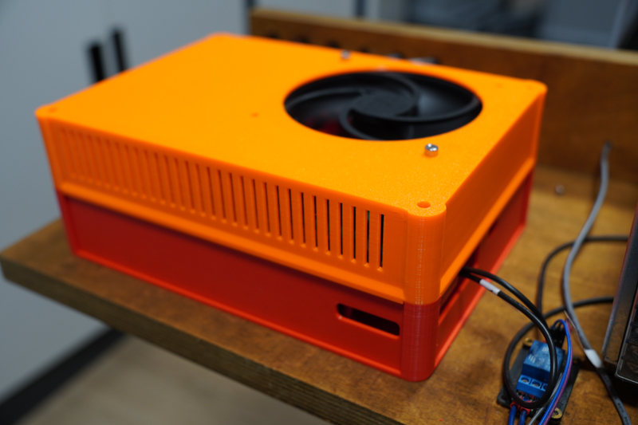

# Gehäuse

Auf dieser Seite sammle ich Ideen und Konstruktionen für Gehäuse. Wenn Du etwas hast oder findest, dass hierzu passt, passe diese Seite gerne direkt über Github an, oder schick mir eine Mail.

<table><thead><tr><th width="349.3333333333333">Bilder</th><th>Beschreibung</th><th>Link</th></tr></thead><tbody><tr><td> </td><td>Remix des originalen OPEN-CNC-Shield 1 Gehäuses von <a href="https://www.printables.com/de/social/115445-maik11488">maik11488</a> für das OPEN-CNC-Shield 2.  Der Remix stammt von <a href="https://www.printables.com/de/social/367093-hartmuta">HartmutA</a>.  </td><td><a href="https://www.printables.com/de/model/155004-open-cnc-shield-case">Original</a>  <a href="https://www.printables.com/de/model/330611-open-cnc-shield-2-case">Remix für OCS2</a></td></tr><tr><td></td><td>Ein weiterer Remix des originalen OCS1 Gehäuses für das OCS2, diesmal von mir.</td><td><a href="https://www.thingiverse.com/thing:5783111">Thingiverse</a></td></tr><tr><td></td><td>Ein Gehäuse von <a href="https://www.printables.com/social/62007-alfred/about">Alfred</a></td><td><a href="https://www.printables.com/model/364968-yet-another-open-cnc-shield-v2-case?fbclid=IwAR2Cp-HQXVGsMuhAhymE-8eZPH_f7hO9c2St5cfWeICS0HGwdVZiNUMcx4k">Printables</a></td></tr><tr><td></td><td></td><td></td></tr></tbody></table>
