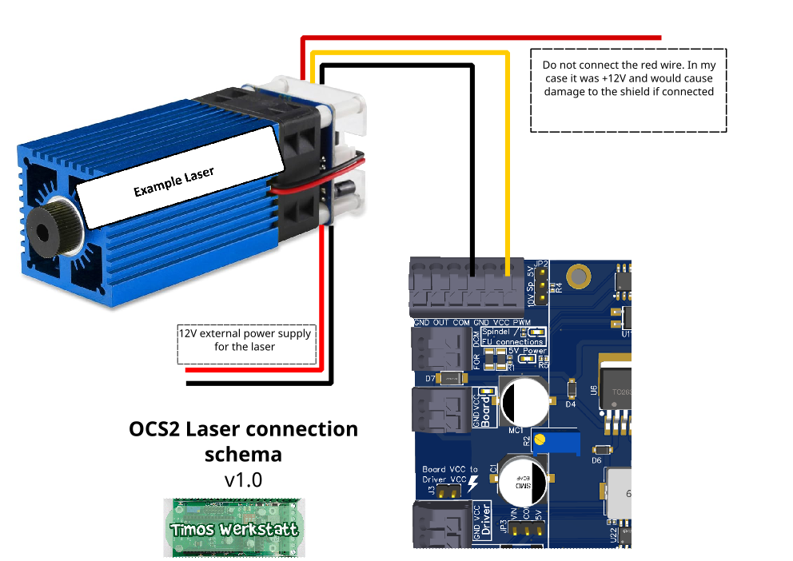
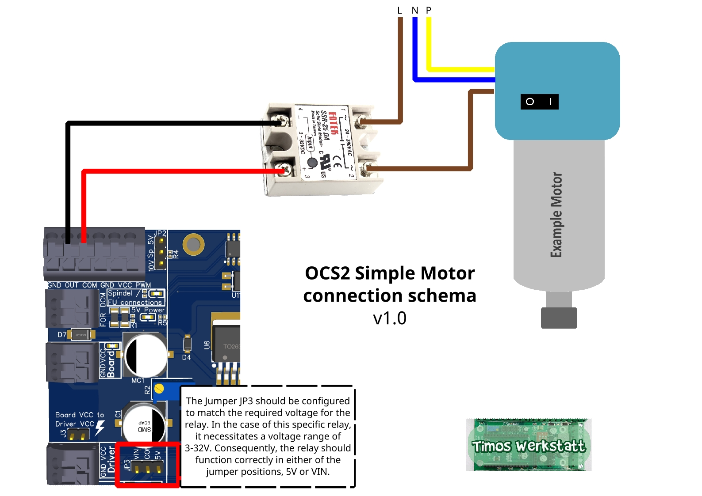
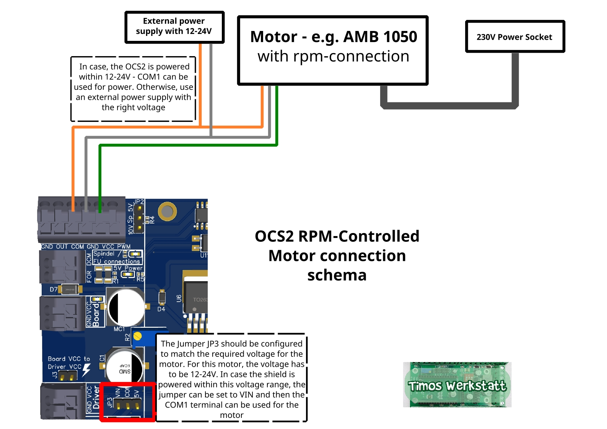
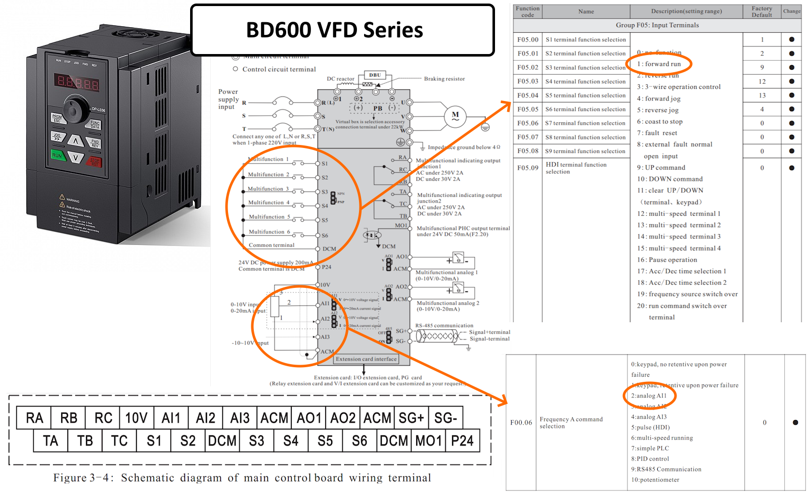
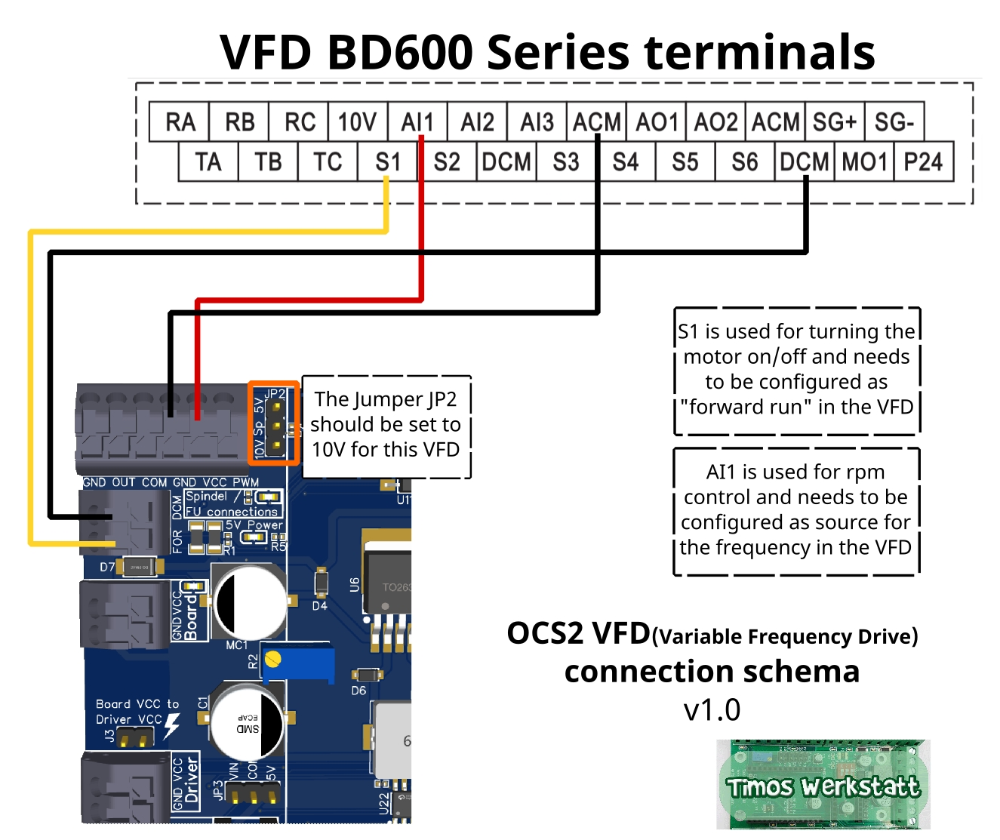

# Spindel / Laser / FU / Motor Anschluss

Auf dieser Seite zeige ich einige Beispiele für den Anschluss verschiedener Geräte an das OPEN-CNC-Shield 2. Das OPEN-CNC-Shield 2 bietet vielfältige Möglichkeiten der Spindel Steuerung. Unter anderem ist es möglich diese ein- und auszuschalten oder die Drehzahl zu regulieren.

Die Dokumentation der einzelnen Anschlüsse ist hier zu finden: [#spindel-motor-laser-steuerung](../mainboard-mini/anschluesse-jumper.md#spindel-motor-laser-steuerung "mention")

### Analoges Signal kalibrieren

Wenn eine externe Drehzahlsteuerung verwendet werden soll, kann das analoge Signal auf \~10 V kalibriert werden. Diese Kalibrierung muss nur einmal durchgeführt werden. Die Prozedur für das OPEN-CNC-Shield 2 ist identisch mit der im folgenden Video gezeigten Kalibrierung am OPEN-CNC-Shield 1. Stelle sicher, dass das Multimeter an den Anschlüssen GND und VCC angeschlossen ist.&#x20;


Versuche nicht die 10V genau zu treffen. Es gibt immer Toleranzen / Abweichungen / Schwankungen.




**Hier nochmal kurz zusammengefasst**:

1. Platine mit Strom versorgen.
2. Arduino am Computer mit Estlcam anschließen
3. Multimeter auf Gleichstrommessung stellen und an den Terminals für die "Spindel/FU connections" anschließen. Dabei kommt der Minus-Pol an GND und der Plus-Pol an VCC.
4. In der CNC Steuerung von Estlcam den Arduino Mega mit richtigen Port auswählen.
5. Unter dem Reiter _Fräsmotor_ die Einstellungen für die China Spindel laden.
6. Die Steuerung programmieren.
7. Den Spindelmotor über die Estlcam Oberfläche starten und den Befehl „pwm100“ in der Kommandozeile eintippen.
8. Sicherstellen, dass der Schieberegler für die Spindel Geschwindigkeit über 100 % steht und dann so lange an der Stellschraube auf dem Potentiometer(kleines blaues Bauteil mit Schlitz-Schraube) drehen, bis das Multimeter etwa 10V anzeigt.


Achtung, die Schraube des Potentiometers kann auch überdreht werden, dann hilft nur noch ein Austausch des Potentiometers.


1. Fertig.

### Laser

<figure><figcaption></figcaption></figure>



Der von mir verwendete Laser benötigt eine Spannungsversorgung von 12V, die ich von einem externen Netzteil beziehe. Da der Laser nur aktiviert wird, wenn ein PWM-Signal vorhanden ist, habe ich auf die Verwendung eines Relais zur Stromversorgung des Lasers verzichtet, obwohl dies eine mögliche Option wäre. In diesem Fall würde das Relais genauso wie die Spindeln an den Anschluss "Spindel Relais" auf der Platine angeschlossen.

Damit der TTL-Modus des Lasers ordnungsgemäß funktioniert, benötigt er ein sauberes PWM-Signal von entweder 0V oder 5V. Dieses Signal ist am Anschluss "PWM" auf der Platine verfügbar. Es ist wichtig zu beachten, dass der Anschluss "VCC" selbst dann nicht mit einem Laser funktioniert, wenn der Jumper für 5V gesetzt ist. Der "VCC"-Anschluss gibt lediglich eine analoge Spannung aus.


Wichtig, bei meinem Laser lagen an dem roten Kabel von TTL 12V an. Diese keinesfalls mit der Platine verbinden. Dabei können Bauteile zerstört werden. Es reicht das gelbe Signal Kabel und das schwarze GND Kabel anzuschließen.


### Spindel / Motor

#### Fräse ohne Drehzahlsteuerung - nur An / Aus

<figure><figcaption></figcaption></figure>



Der Fräsmotor wird über ein Relais mit der Steuerung verbunden. Ich empfehle die Verwendung eines Solid State Relais mit Nulldurchgangsschaltung. Es gilt zu beachten, dass je nach Stromentnahme das Relais heiß werden kann und daher einen Kühlkörper benötigt.

Die üblichen mechanischen 5V Relais, wie sie beispielsweise für Arduinos verwendet werden, sind nicht geeignet. Sie können Störungen verursachen und sind normalerweise nicht für höhere Ströme ausgelegt, wodurch ihre Lebensdauer beeinträchtigt wird.

#### Fräse mit Drehzahlsteuerung

Eine externe Drehzahlsteuerung wird zum Beispiel von einer AMB 1050 FME oder auch Fräsen von Mafell unterstützt.

<figure><figcaption></figcaption></figure>



Die Fräse kann direkt an das OPEN-CNC-Shield 2 angeschlossen werden, ohne die Notwendigkeit eines Relais. Wenn das Shield eine Drehzahl von 0V ausgibt, bleibt die Fräse stehen.&#x20;


Für zusätzliche Sicherheit kann auch hier ein SSR-Relais zur Unterbrechung der Stromversorgung der Fräse verwendet werden, wie im obigen Beispiel "Fräse ohne Drehzahlsteuerung" gezeigt.


Das braune Kabel kann entweder an COM1 angeschlossen werden, sofern die Spannung der Fräse(Anleitung/Datenblatt beachten) mit der Spannung des Shields übereinstimmt, oder an ein externes Netzteil angeschlossen werden.

### Frequenzumrichter / FU

Es existieren zahlreiche unterschiedliche Frequenzumrichter auf dem Markt, und bedauerlicherweise variiert deren Anschlussart leicht. Aus diesem Grund ist es nicht möglich, einen spezifischen, korrekten Ansatz zu erläutern. Stattdessen kann auf einige wichtige Aspekte hingewiesen werden, auf die bei der Installation zu achten ist.

Meistens möchte man zwei Funktionen des Frequenzumrichters mit dem Shield verbinden:

#### Ein- und Ausschalten der Spindel

Diese Funktion sorgt dafür, dass die Spindel startet, unabhängig von der Drehzahl. Je nach FU kann es sein, dass es direkt Terminals dafür gibt. Diese sind dann mit "FOR" für forward oder "REV" für reverse beschriftet. Es kann aber auch sein, dass der FU variable bzw. konfigurierbare Eingänge hat. Diese müssen dann entsprechend konfiguriert werden. Im folgenden Beispiel geht es um einen Konfigurierbaren FU.

#### Automatische Drehzahlregulierung

Mit dieser Funktion gibt die Steuersoftware(z.b. Estlcam) die Geschwindigkeit der Spindel vor und kann diese anpassen. Diese Bezeichnung des entsprechenden analogen Inputs am FU ist der Bedienungsanleitung zu entnehmen. Es gilt zu beachten, dass der FU auch so eingestellt werden muss, dass das externe Signal verwendet wird. Dies passiert bei manchen über einen Jumper, bei manchen über die Konfiguration. Standardmäßig wird der Poti am FU zur Regulierung der Geschwindigkeit verwendet.

#### Beispiel FU BD600

Im Folgenden nehmen wir einen FU der BD600er Serie als Beispiel. Hier einmal die relevanten Ausschnitte aus dem Datenblatt:

<figure><figcaption>
BD600 Datenblatt
</figcaption></figure>

Hier einmal das "basic wiring" Diagramm, auf dem schon 6 Multi-Funktionale Inputs zu sehen sind, sowie die analogen Inputs(beides orange eingekreist).

Den Multi-Funktionalen Inputs können wir dann eine entsprechende Funktion in der Konfiguration des FU zuweisen. Dazu sehen wir rechts die entsprechenden Möglichkeiten. Für die An-Aus-Funktion müssen wir zum Beispiel dem Anschluss S1 die Funktion "forward run" zuweisen. Dann sollte die Spindel in Vorwärtsrichtung einschalten, sobald eine Verbindung zwischen S1 und DCM besteht.

Für die Drehzahlregulierung wird der analoge Input genutzt. Dazu muss dies entsprechend in dem FU konfiguriert werden(siehe Tabelle unten rechts im Bild). Die "Frequency A command selection" können wir zum Beispiel auf den Anschluss AI1 legen. Danach sollte die Spannung an dem Terminal AI1 die Drehzahl vorgeben.&#x20;

<figure><figcaption></figcaption></figure>




Weitere Informationen zum Einstellen und Anschließen eines Frequenzumrichters findet man auch auf der Estlcam Seite. Dort ist dies noch einmal sehr gut beschrieben: [Estlcam – Chinaspindel](https://www.estlcam.de/chinaspindel.php)

