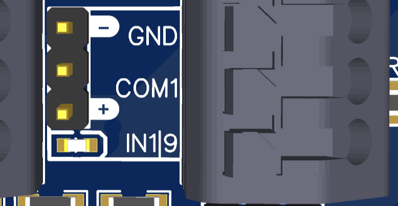

# Relais und Federklemmen

<figure><figcaption></figcaption></figure>

 

<figure><figcaption></figcaption></figure>

### Überblick

* 8 Eingänge
* Eingänge schalten entweder mit GND/Masse oder mit 5-24V (über einen Jumper umschaltbar)
* 4 Ausgänge(2 mit einem 5A Relais)
* Ausgänge sind mit Darlington Relays versehen - schalten also GND/Masse an den OUTs
* 500mA pro Ausgang
* COM-Spannung für Ausgänge wählbar zwischen 5V und Eingangsspannung des OPEN-CNC-Shields (normalerweise 24V) oder selbst angelegter Spannung
* Anzeige der aktuellen Stati über LEDs

### Technische Daten

| Eigenschaft                               | Wert                    |
| ----------------------------------------- | ----------------------- |
| maximaler Strom Relais-Ausgänge 1 und 2   | 5A (etwa 1 kW bei 230V) |
| maximale Spannung Relais Ausgänge 1 und 2 | 250VAC / 30VDC          |
| maximaler Strom Ausgänge 3 und 4          | 500mA                   |
| maximale Spanung für Ausgänge 3 und 4     | 50V                     |
| maximale Spannung an Eingängen            | 24V                     |

Die schematischen Zeichnungen und DXF files zu der Platine sind auf Github zu finden:

{% embed url="https://github.com/timo1235/cnc-werkstatt/tree/master/OPEN-CNC-Shield%202.x/OCS2%20modules/InOutModules/InOutModule%20Spring%20Relay" %}

### Jumper

| Jumper                                                                                                    | Beschreibung                                                                                                                                                                                                                                                                                                                                     |
| --------------------------------------------------------------------------------------------------------- | ------------------------------------------------------------------------------------------------------------------------------------------------------------------------------------------------------------------------------------------------------------------------------------------------------------------------------------------------ |
| 

       | 
Hier kann die Spannung für COM1 und COM2 mit einem Jumper eingestellt werden. - ist der Jumper in der linken Position, liegt die OCS2 Eingangsspannung an (normalerweise 24V) - ist der Jumper in der rechten Position, liegen 5V an.  - Ohne Jumper kann eine eigene Spannung an den jeweils mittleren Pin angelegt werden. 
 |
| 

 | 
Jumper für die Eingänge am Beispiel von Eingang 1: - <strong>Jumper in der oberen Position:</strong> An IN1 wird geschaltet, sobald dort GND anliegt - <strong>Jumper in der unteren Position:</strong> IN1 wird geschaltet, sobald eine Spannung zwischen 5-24V anliegt
                                                            |
