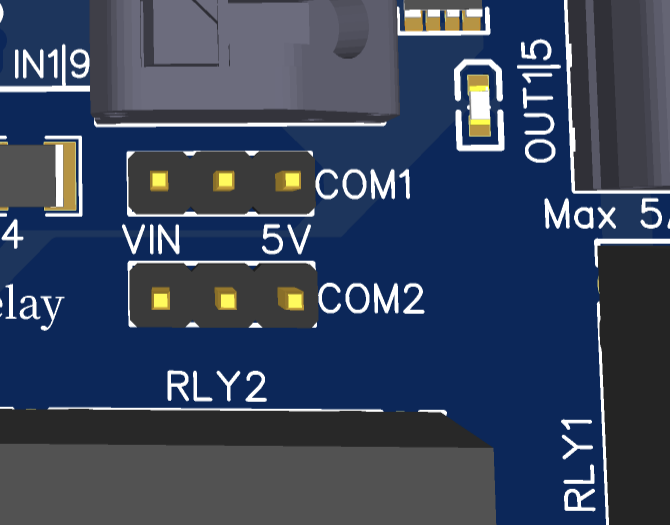

# Relais und Federklemmen

<figure><figcaption></figcaption></figure>

 

<figure><figcaption></figcaption></figure>

### Überblick

* 8 Eingänge
* Eingänge schalten entweder mit GND/Masse oder mit 5-24V (über einen Jumper umschaltbar)
* 4 Ausgänge(2 mit einem 5A Relais)
* Ausgänge sind mit Darlington Relays versehen - schalten also GND/Masse an den OUTs
* 500mA pro Ausgang
* COM-Spannung für Ausgänge wählbar zwischen 5V und Eingangsspannung des OPEN-CNC-Shields (normalerweise 24V)
* Anzeige der aktuellen Stati über LEDs

### Technische Daten

<table><thead><tr><th width="421">Eigenschaft</th><th>Wert</th></tr></thead><tbody><tr><td>maximaler Strom Relais-Ausgänge 1 und 2</td><td>jeweils 5A (etwa 1 kW bei 230V) </td></tr><tr><td>maximale Spannung Relais Ausgänge 1 und 2</td><td>250VAC / 30VDC</td></tr><tr><td>maximaler Strom Ausgänge 3 und 4</td><td>jeweils 500mA</td></tr><tr><td>maximale Spannung für Ausgänge 3 und 4</td><td>50V - die Spannung kann an COM2 angelegt werden. Der Jumper für COM2 darf in diesem Fall nicht gesetzt sein</td></tr><tr><td>maximale Spannung an Eingängen </td><td>24V</td></tr></tbody></table>

Die schematischen Zeichnungen und DXF files zu der Platine sind auf Github zu finden:

{% embed url="https://github.com/timo1235/cnc-werkstatt/tree/master/OPEN-CNC-Shield%202.x/OCS2%20modules/InOutModules/InOutModule%20Spring%20Relay" %}

### Jumper

| Jumper                                                                                                    | Beschreibung                                                                                                                                                                                                                                                                                                                                                                                                                                                                                                                                                                                                |
| --------------------------------------------------------------------------------------------------------- | ----------------------------------------------------------------------------------------------------------------------------------------------------------------------------------------------------------------------------------------------------------------------------------------------------------------------------------------------------------------------------------------------------------------------------------------------------------------------------------------------------------------------------------------------------------------------------------------------------------- |
| 

       | 
Hier kann die Spannung für COM1 und COM2 mit einem Jumper eingestellt werden. - ist der Jumper in der linken Position, liegt die OCS2 Eingangsspannung an (normalerweise 24V) - ist der Jumper in der rechten Position, liegen 5V an.  
                                                                                                                                                                                                                                                                                                                                                     |
| 

 | 
Jumper für die Eingänge am Beispiel von Eingang 1: - <strong>Jumper in der oberen Position:</strong> An IN1 wird geschaltet, sobald dort GND anliegt, beachte auch den Hinweis für PCB >=1.06 unten - <strong>Jumper in der unteren Position:</strong> IN1 wird geschaltet, sobald eine Spannung zwischen 5 und 24 V anliegt <strong>Hinweis, ab PCB >=1.06:</strong> Falls mit GND geschaltet werden soll, <strong>muss COM1 auf 5V oder VIN stehen</strong>. Meistens ist 5V die richtige Wahl. Wenn z.b. ein 24V NPN Schalter genutzt wird, sollte COM1 mit VIN(24V) gejumpert werden
 |

### Beispiele Ein- und Ausgänge nutzen


Beispiele für die Nutzung gibts hier: [ein-und-ausgaenge-nutzen.md](../guides-zubehoer/ein-und-ausgaenge-nutzen.md "mention")


