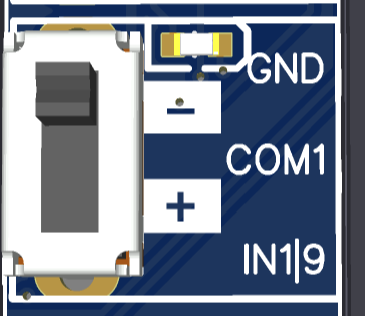

# Steckbar

<figure><figcaption></figcaption></figure>

 

<figure><figcaption></figcaption></figure>

### Überblick

* 8 Eingänge
* Eingänge schalten entweder mit GND/Masse oder mit 5-24V (über einen Jumper umschaltbar)
* 4 Ausgänge
* Ausgänge sind mit Darlington Relays versehen - schalten also GND/Masse an den OUTs
* 200mA pro Ausgang
* COM-Spannung für Ausgänge wählbar zwischen 5V und Eingangsspannung des OPEN-CNC-Shields (normalerweise 24V)
* Anzeige der aktuellen Stati über LEDs

### Technische Daten

<table><thead><tr><th width="421">Eigenschaft</th><th>Wert</th></tr></thead><tbody><tr><td>maximaler Strom Ausgänge</td><td>jeweils 200mA</td></tr><tr><td>maximale Spanung Ausgänge</td><td>50V -  die Spannung kann an COM2 angelegt werden. Der Jumper für COM2 darf in diesem Fall nicht gesetzt sein</td></tr><tr><td>maximale Spannung an Eingängen </td><td>24V</td></tr></tbody></table>

Die schematischen Zeichnungen und DXF files zu der Platine sind auf Github zu finden:

{% embed url="https://github.com/timo1235/cnc-werkstatt/tree/master/OPEN-CNC-Shield%202.x/OCS2%20modules/InOutModules/InOutModule%20Pluggable" %}

### Jumper

| Jumper                                                                                | Beschreibung                                                                                                                                                                                                                                                                                                                                                                                                                                                                                                                                                                                    |
| ------------------------------------------------------------------------------------- | ----------------------------------------------------------------------------------------------------------------------------------------------------------------------------------------------------------------------------------------------------------------------------------------------------------------------------------------------------------------------------------------------------------------------------------------------------------------------------------------------------------------------------------------------------------------------------------------------- |
|  | 
Hier kann die Spannung für COM1 und COM2 mit einem Jumper eingestellt werden. - ist der Jumper in der linken Position, liegt die OCS2 Eingangsspannung an (normalerweise 24V) - ist der Jumper in der rechten Position, liegen 5V an.  
                                                                                                                                                                                                                                                                                                                                         |
|        | 
Schalter für die Eingänge am Beispiel von Eingang 1: - <strong>Schalter in der oberen Position:</strong> An IN1 wird geschaltet, sobald dort GND anliegt, beachte auch den Hinweis für PCB >=1.03 unten - <strong>Schalter in der unteren Position:</strong> IN1 wird geschaltet, sobald eine Spannung zwischen 5 und 24V anliegt <strong>Hinweis, ab PCB >=1.03:</strong> Falls mit GND geschaltet werden soll, muss COM1 auf 5V oder VIN stehen. Meistens ist 5V die richtige Wahl. Wenn z.b. ein 24V NPN Schalter genutzt wird, sollte COM1 mit VIN(24V) gejumpert werden
 |

### Beispiele Ein- und Ausgänge nutzen


Beispiele für die Nutzung gibts hier: [ein-und-ausgaenge-nutzen.md](../guides-zubehoer/ein-und-ausgaenge-nutzen.md "mention")

