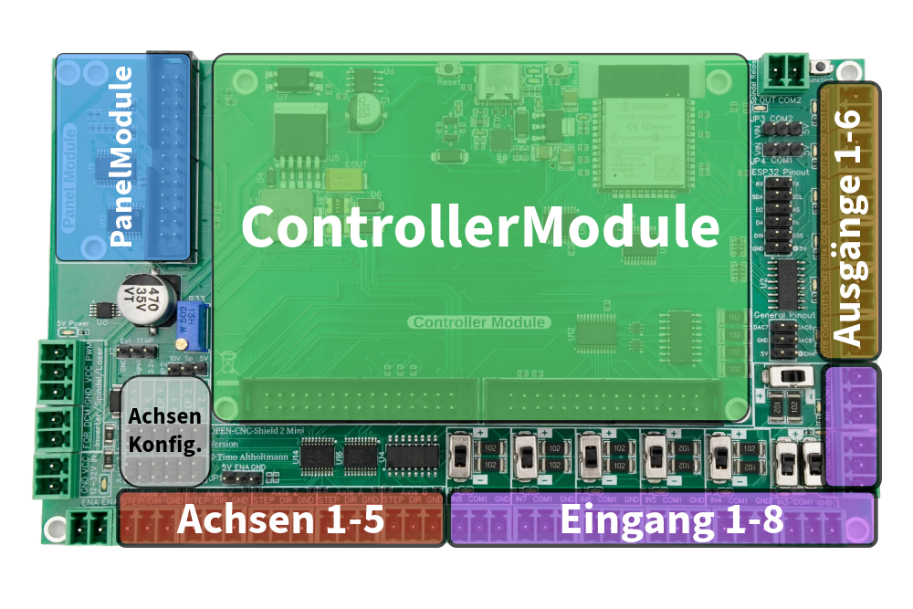

# Mainboard Mini

## Kurzbeschreibung

Das OPEN-CNC-Shield 2 Mini ist die kompakte und kosteneffiziente Weiterentwicklung des erfolgreichen OPEN-CNC-Shield 2. Trotz seiner geringeren Größe bietet es umfassende Funktionen und ist vollständig kompatibel mit allen Controller- und Panelmodulen des großen Bruders. Dank fest verbautem ESP32 und identischer Firmware bleiben die erweiterten Funktionen erhalten. Das Shield eignet sich ideal für den Hobby- und semiprofessionellen Einsatz.

#### Kurzübersicht der Features(Kann je nach Controller auch abweichen):

* 100 % kompatibel zu allen [ControllerModules](../controllermodules/)
* 100 % kompatibel zu allen [PanelModules](../panelmodules/)
* Fest verbauter ESP32:&#x20;
  * Die gleiche Firmware wie beim OPEN-CNC-Shield 2 Mainboard
  * Autosquaring der Achsen
  * Temperaturüberwachung
  * Wi-Fi Bedienpanel
  * individuelle Programmierung möglich
* 5 Achsen möglich:
  * &#x20;Ideal für vielfältige Anwendungen und Erweiterungen.
  * Achsenkonfiguration zum Einrichten gleichlaufender Achsen
* 8 Eingänge: Flexibel beschaltbar mit GND oder VCC.
* 6 Ausgänge: Für vielseitige Steuerungsmöglichkeiten.
* Kostenersparnis: Keine zusätzlichen [InOutModule ](../inoutmodules/)erforderlich, sowie keine [DriverModule ](../drivermodules/)notwendig. Es sollten externe Treiber verwendet werden, vergleichbar mit dem Arduino Club Board oder dem Estlcam Klemmenadapter.
* Spindelgeschwindigkeitssteuerung mit 0-5V, 0-10V oder 5V PWM
* Spindel An-/Aus Anschluss zum Schalten eines Relais
* Genug Anschlussmöglichkeiten für externe Bedienelemente wie Bedienpults, Handräder etc.

## Board Übersicht

<figure><figcaption></figcaption></figure>

Die Hauptplatine ist in mehrere Bereiche unterteilt. Es gibt Steckplätze für folgende Module:

* 1 x Controller Module
* 1 x Panel Module

Diese werden in den nächsten Abschnitten genauer erklärt. Es müssen nicht alle Module besetzt bzw. genutzt werden.&#x20;

### Technische Details

<table><thead><tr><th width="295">Eigenschaft</th><th>Wert</th></tr></thead><tbody><tr><td>Eingangsspannung</td><td>12-32V</td></tr><tr><td>Empfohlene Stromstärke Netzteil</td><td>1 A @ 24V</td></tr><tr><td>Maximale Achsen</td><td>5</td></tr><tr><td>Steuersignale STEP und DIR</td><td>Gepuffert mit bis zu 25mA</td></tr><tr><td>Eingänge </td><td>8</td></tr><tr><td>Spannung Eingänge</td><td>
Es gibt zwei mögliche Schaltungen (wählbar, mit einem Switch direkt auf der Platine)
<ul><li>Schalten mit GND (Eingang löst aus, wenn GND anliegt)</li><li>Schalten mit VCC (Eingang löst aus, wenn 5-24V anliegen)</li></ul></td></tr><tr><td>Ausgänge</td><td>6</td></tr><tr><td>Spannung Ausgänge</td><td>Schaltung mit Darlington Transistor Array ULN2003.  Spannung max. 50V und max. 500mA pro Ausgang</td></tr><tr><td>Anschlüsse zur Steuerung der Spindelgeschwindigkeit</td><td><ul><li>0-10V Analog</li><li>0-5V Analog</li><li>5V PWM</li></ul></td></tr><tr><td>Anschluss Spindel Ein/Aus</td><td><ul><li>FOR/DCM (Optokoppler Schalter)</li><li>Spindel OUT für Relais (ULN2003 max. 50V und 500mA)</li></ul></td></tr><tr><td>Steuerspannung Motortreiber</td><td>5V</td></tr></tbody></table>

Die schematischen Zeichnungen und DXF Files zu der Platine sind auf Github zu finden:

{% embed url="https://github.com/timo1235/cnc-werkstatt/tree/master/OPEN-CNC-Shield%202.x/OCS2%20mainboard" %}

<figure><figcaption></figcaption></figure>

### Hinweise Versionen

#### Version 1.2

In der Version 1.2 gibt es leider einen kleinen Beschriftungsfehler. Der Schalter für den Wechsel zwischen GND und VCC bei IN2 ist vertauscht. Es ist daher notwendig, die Beschriftung entsprechend umgekehrt zu interpretieren. Es besteht keine Gefahr, etwas zu beschädigen.

