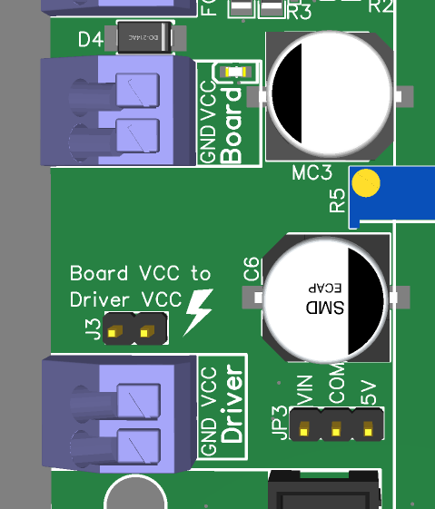
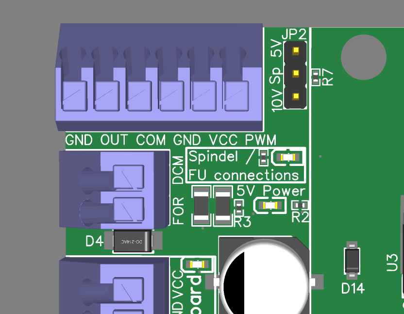
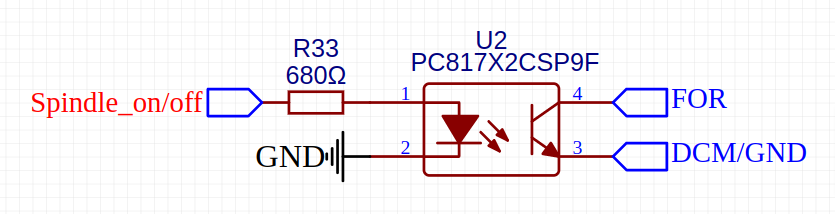
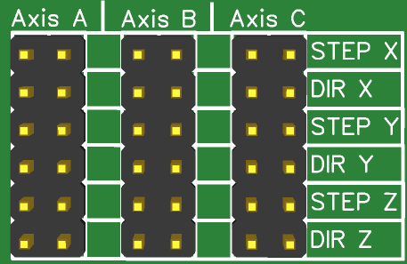
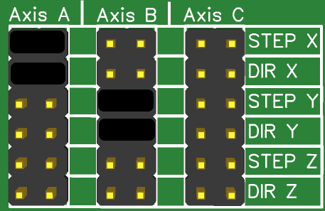
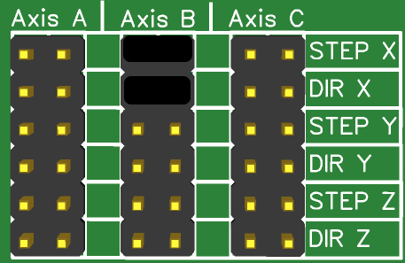

# Anschlüsse / Jumper

Neben den Steckplätzen für die Erweiterungen bietet das Mainboard verschiedene Anschlüsse und Jumper.

### Stromversorgung

<figure><figcaption></figcaption></figure>

<table><thead><tr><th width="161">Beschriftung</th><th width="300">Funktion</th><th>Technisches</th></tr></thead><tbody><tr><td>Board GND</td><td>GND</td><td></td></tr><tr><td>Board VCC</td><td>Stromversorgung für das Shield inkl. Erweiterungen</td><td>Spannung: 12-24V  Strom: etwa 3A </td></tr><tr><td>Driver GND</td><td>GND</td><td></td></tr><tr><td>Driver VCC</td><td>Stromversorgung ausschließlich für die Aufstecktreiber. Kann die gleiche Spannung wie das Board besitzen - Es kann aber auch eine andere Spannung genutzt werden. Zum Beispiel Board 24V und Treiber 40V.</td><td>max. 50V Unbedingt das Datenblatt der Aufstecktreiber beachten!</td></tr></tbody></table>

### Spindel / Motor / Laser Steuerung

<figure><figcaption></figcaption></figure>

Diese Anschlüsse können für die Steuerung einer Spindel oder eines Lasers genutzt werden.&#x20;

<table><thead><tr><th width="114">Beschriftung</th><th width="334">Funktion</th><th>Technisches</th></tr></thead><tbody><tr><td>GND</td><td>GND</td><td></td></tr><tr><td>OUT</td><td>Open-Collector Ausgang für das Signal "Spindle on/off". Hier liegt im geschalteten Zustand GND an.</td><td>max. 500mA </td></tr><tr><td>COM</td><td>Spannung für den Open-Collector Ausgang "OUT". Kann am Jumper JP3 eingestellt werden. Mögliche Spannung ist dort 5V oder V-Board  - also die Spannung die am Board anliegt. Es kann auch eine eigene Spannung angelegt werden.</td><td>Entweder 5V, V-Board oder eigene Spannung - max. 50V(ULN2003 IC)</td></tr><tr><td>GND</td><td>GND</td><td></td></tr><tr><td>VCC</td><td>Analoge Spannung für die Spindel Geschwindigkeit. Diese wird aus dem PWM Signal erzeugt und kann am Jumper JP2 entweder auf 0-5V oder auf 0-10V eingestellt werden. Dieser Ausgang kann mit dem Drehpotentiometer R5 kalibriert werden. Dazu in dem Controller(z.b. Estlcam) die Spindel voll aufdrehen und mit einem Messgerät zwischen VCC und GND messen. Durch verstellen des Potis lässt sich die Spannung auf 10V einstellen.</td><td>0-5V oder 0-10V</td></tr><tr><td>PWM</td><td>PWM Signal zur Steuerung der Leistung von z.B. Lasern.</td><td>5V PWM</td></tr><tr><td>FOR</td><td>Galvanische getrennter Ausgang für Frequenzumrichter(FU). Wird bei dem FU an "vorwärts" oder "start" oder ähnlichem angeschlossen. DCM muss ebenfalls angeschlossen werden.</td><td></td></tr><tr><td>DCM</td><td>Wird beim FU an "DCM" oder "GND" oder ähnlichem angeschlossen.</td><td>Siehe "FOR"</td></tr></tbody></table>


Für den Anschluss diverser Spindeln gibt es hier Bespiele: [spindel-laser-fu-motor-anschluss.md](../guides-zubehoer/spindel-laser-fu-motor-anschluss.md "mention")


### Jumper und sonstige Anschlüsse

<table><thead><tr><th width="189">Beschriftung</th><th>Funktion</th></tr></thead><tbody><tr><td>
JP1 ENA-Jumper  Beschriftung:

<strong>5V/ENA/GND</strong>
</td><td>Jumper für den Enable der Treiber. Kann gesetzt werden, wenn die Treiber selbst keinen Pullup oder Pulldown Widerstand besitzen. Gilt für alle Treiber.</td></tr><tr><td>JP2 Spindel-Jumper Beschriftung: <strong>10V/Sp/5V</strong></td><td>Jumper für den analogen Spindel Ausgang. Wählt zwischen 0-5V und 0-10V</td></tr><tr><td>JP3 Spindel On-Off Jumper Beschriftung: <strong>VIN/COM/5V</strong></td><td>Wählt die Spannung für den "Spindel on/off" Ausgang bzw. die Open-Collector Spannung "COM". Wahlmöglichkeiten sind 5V oder die Boardspannung V-Board. Wenn der Jumper frei gelassen wird, kann auch eine eigene Spannung bis 50V angelegt werden.</td></tr><tr><td>J1 FAN-Stecker</td><td>Anschluss eines 2-Pin oder 3-Pin 12V Lüfters.</td></tr><tr><td>J2 Temp-Stecker</td><td>Anschluss für einen oder mehrere DS18B20 Temperatursensoren. Diese können mit dem ESP32 ausgelesen werden.</td></tr><tr><td>J3 Board VCC to Driver VCC - Jumper</td><td>Verbindet die Board Spannung mit der Motortreiber Spannung. Achtung: - nur nutzen, wenn die Aufstecktreiber weniger als 2A nutzen(zum Beispiel nur die z-Achse ist mit einem Aufstecktreiber versehen) - nur nutzen, wenn Driver VCC und Driver GND nicht verbunden sind <strong>Eine Kabelbrücke oder ein extra Netzteil an den Anschlüssen Driver GND und Driver VCC ist immer zu bevorzugen</strong>.</td></tr></tbody></table>

### General Pinout

<figure><figcaption>
Pin 1 ist an dem Punkt.  In dieser Ansicht ist darüber  Pin 2 usw.
</figcaption></figure>

<table><thead><tr><th width="80">Pin</th><th>Funktion</th><th width="67">Pin</th><th>Funktion</th></tr></thead><tbody><tr><td>1</td><td>5V</td><td>2</td><td>GND</td></tr><tr><td>3</td><td>5V</td><td>4</td><td>GND</td></tr><tr><td>5</td><td>5V</td><td>6</td><td>DAC_A07</td></tr><tr><td>7</td><td>GND</td><td>8</td><td>DAC_A06</td></tr><tr><td>9</td><td>GND</td><td>10</td><td>DAC_A08</td></tr><tr><td>11</td><td>GND</td><td>12</td><td>ENA - Enable</td></tr></tbody></table>

### ESP32 Pinout

<figure><figcaption>
Pin 1 ist an dem Punkt.  In dieser Ansicht ist darüber  Pin 2 usw.
</figcaption></figure>

<table><thead><tr><th width="80">Pin</th><th>Funktion</th><th width="67">Pin</th><th>Funktion</th></tr></thead><tbody><tr><td>1</td><td>+5V  (PCB Version &#x3C; 2.09: ESP32_D32)</td><td>2</td><td>GND (PCB Version &#x3C; 2.09: ESP32_D27)</td></tr><tr><td>3</td><td>ESP32_D35</td><td>4</td><td>ESP32_D19</td></tr><tr><td>5</td><td>ESP32_D34</td><td>6</td><td>GND</td></tr><tr><td>7</td><td>Autosquare (siehe Hinweis unten)</td><td>8</td><td>ESP32_D2</td></tr><tr><td>9</td><td>ESP32_SCL</td><td>10</td><td>ESP32_SDA</td></tr><tr><td>11</td><td>ESP32_TX</td><td>12</td><td>ESP32_RX</td></tr></tbody></table>


Um die Autosquare-Funktion an diesem Pinout zu nutzen muss ein Schalter/Taster zwischen GND und dem Autosquare-Pin angeschlossen werden.&#x20;


### Achsenkonfiguration

Diese Pin Leisten können mit Jumpern versehen werden, um Achsen **unabhängig vom verwendeten Controller** gleich laufen zu lassen. Ebenfalls hat die Konfiguration keinen Einfluss die Funktionalität des Autosquaring vom ESP32. Die Achsen-Einstellungen für das Autosquaring werden direkt in der Software des ESP32 getätigt.

<figure><figcaption></figcaption></figure>

Bei einigen Controllern kann man gleichlaufende Achsen direkt in der Software des Controllers einstellen, aber bei manchen auch nicht. Dafür können dann diese Pin-Header genutzt werden.

#### Beispiel Estlcam mit Arduino Mega und zwei X- und zwei Y Achsen


Dieses Beispiel gitl nur für das ControllerModule Estlcam mit Arduino Mega! Bei dem ControllerModule Estlcam Klemmenadapter wird die A-Achse bereits für "Y-Rechts"  verwendet.


Estlcam kann nur 3 Achsen steuern. X, Y und Z. Hat man nun aber eine Fräse mit zwei Motoren auf einer Achse wie zum Beispiel der MPCNC oder der LowRider kann man hier die Achsen gleich laufend einstellen. Im folgenden Bild sind die Jumper so gesteckt, dass die Achse A gleichlaufend mit der x-Achse und die Achse B gleichlaufend mit der y-Achse ist.

<figure><figcaption></figcaption></figure>

**Beispiel Estlcam mit Klemmenadapter und zwei X- und zwei Y-Achsen**

Estlcam unterstützt nur drei Achsen: X, Y und Z. Mit dem [Klemmenadapter-Controller](../controllermodules/estlcam-1.md) kann jedoch die Y-Achse separat gesteuert werden, wobei Y-Links und Y-Rechts verfügbar sind ([Details dazu in der Klemmenadapter-Dokumentation](../controllermodules/estlcam-1.md)). Da in diesem Beispiel zwei Achsen jeweils zwei Motoren haben, muss die X-Achse am OCS2 dupliziert werden. Dafür verwenden wir die B-Achse, die wie folgt gejumpert wird:

* Axis B -> STEP X
* Axis B -> DIR X

Die Y-Achse muss nicht gejumpert werden, da sie bereits über den Klemmenadapter auf Achse A dupliziert ist.

Nun entscheiden du selbst, ob beide Achsen über das OCS2 autosquared werden sollen (dies im Webinterface konfigurieren) oder ob Estlcam die Y-Achse ausrichtet und das OCS2 nur die X-Achse.

#### Beispiel Beamicon mit 4 Achsen und zwei Motoren auf X

Die CNC-Pod Controller von Beamicon unterstützt 4 Achsen. Die belegten Achsen sind X, Y, Z und A. Daher sollte die a-Achse nicht mehr für die Konfiguration verwendet werden. Aber die b- und c-Achse sind frei. Demnach kann man den zweiten Motor für die x-Achse zum Beispiel auf die b-Achse legen. Das folgende Bild zeigt die Jumper-Einstellung dafür.

<figure><figcaption></figcaption></figure>
