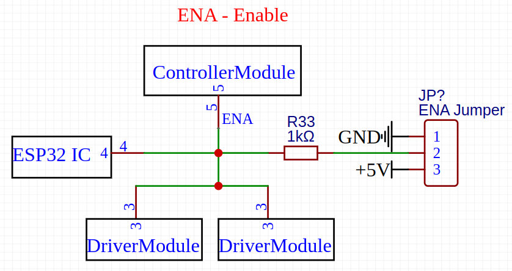
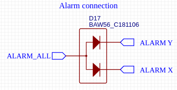
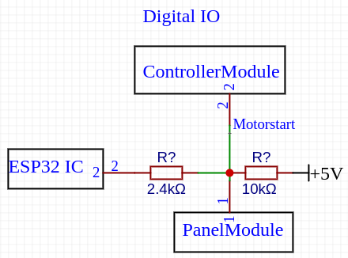
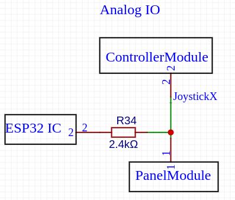

# Controller Module


Diese Seite ist für die Entwicklung neuer ControllerModule und die Fehlersuche relevant.  Für die unterschiedlichen ControllerModule gibt es eigene Dokumentationsseiten. Dort werden die unterstützten Features und technische Details der einzelnen Module beschrieben. [controllermodules](../../controllermodules/ "mention")


Das ControllerModule ist das Bindeglied zwischen der Steuerungssoftware und dem OPEN-CNC-Shield 2. Je nach verwendetem Controller kann sich der Funktionsumfang der Steuerung ändern. Die möglichen Anschlüsse an einem Controller Steckplatz orientieren sich an der Estlcam Steuerung mit einem Arduino Mega 2560. Diese Kombination von Software und Hardware bildet die Anforderungen im hobby- und semiprofessionellen Einsatz sehr gut ab.

## Pin Belegung

<figure><figcaption></figcaption></figure>


Typ OUT: Das Signal geht vom Controller / Steuerungssoftware in Richtung OPEN-CNC-Shield

Typ IN: Das Signal kommt vom OPEN-CNC-Shield und geht zum Controller / der Steuerung


### **Connector 1:**

<table><thead><tr><th width="81">Pin</th><th width="219">Beschreibung</th><th width="111">Typ</th><th width="67">Pin</th><th width="198">Beschreibung</th><th width="69">Typ</th></tr></thead><tbody><tr><td>1</td><td><strong>ENA</strong>  Enable der Treiber</td><td>OUT</td><td>2</td><td><strong>Spindel PWM</strong></td><td>OUT</td></tr><tr><td>3</td><td><strong>ESP32 SDA</strong> I2C Pin vom ESP32</td><td>IN</td><td>4</td><td><strong>Spindel on/off</strong></td><td>OUT</td></tr><tr><td>5</td><td><strong>ESP32 SCL</strong> I2C Pin vom ESP32</td><td>IN</td><td>6</td><td><strong>Encoder B</strong> Bedienelement</td><td>IN</td></tr><tr><td>7</td><td><strong>STEP X</strong> Schrittsignal</td><td>OUT</td><td>8</td><td><strong>Encoder A</strong> Bedienelement</td><td>IN</td></tr><tr><td>9</td><td><strong>DIR X</strong> Richtungssignal</td><td>OUT</td><td>10</td><td><strong>Motor Start</strong> Bedienelement</td><td>IN</td></tr><tr><td>11</td><td><strong>STEP Y</strong> Schrittsignal</td><td>OUT</td><td>12</td><td><strong>Programm Start</strong>  Bedienelement</td><td>IN</td></tr><tr><td>13</td><td><strong>DIR Y</strong> Richtungssignal</td><td>OUT</td><td>14</td><td><strong>OK</strong> Bedienelement</td><td>IN</td></tr><tr><td>15</td><td><strong>STEP Z</strong> Schrittsignal</td><td>OUT</td><td>16</td><td><strong>Feedrate</strong> Bedienelement Analog</td><td>IN</td></tr><tr><td>17</td><td><strong>DIR Z</strong> Richtungssignal</td><td>OUT</td><td>18</td><td><strong>Rotation Speed</strong> Bedienelement Analog</td><td>IN</td></tr><tr><td>19</td><td><strong>STEP A</strong> Schrittsignal</td><td>OUT</td><td>20</td><td><strong>Joystick X</strong> Bedienelement Analog</td><td>IN</td></tr><tr><td>21</td><td><strong>DIR A</strong> Richtungssignal</td><td>OUT</td><td>22</td><td><strong>Joystick Y</strong> Bedienelement Analog</td><td>IN</td></tr><tr><td>23</td><td><strong>STEP B</strong> Schrittsignal</td><td>OUT</td><td>24</td><td><strong>Joystick Z</strong> Bedienelement Analog</td><td>IN</td></tr><tr><td>25</td><td><strong>DIR B</strong> Richtungssignal</td><td>OUT</td><td>26</td><td><strong>GND</strong></td><td>IN</td></tr><tr><td>27</td><td><strong>STEP C</strong> Schrittsignal</td><td>OUT</td><td>28</td><td><strong>V-Board</strong> Gleiche Spannung wie die Stromversorgung der Hauptplatine</td><td>IN</td></tr><tr><td>29</td><td><strong>DIR C</strong> Richtungssignal</td><td>OUT</td><td>30</td><td><strong>5V</strong></td><td>IN</td></tr></tbody></table>

### **Connector 2:**

<table><thead><tr><th width="79">Pin</th><th width="235">Beschreibung</th><th width="69">Typ</th><th width="58">Pin</th><th width="226">Beschreibung</th><th width="72">Typ</th></tr></thead><tbody><tr><td>1</td><td><strong>Alarm all</strong> Alarmausgang aller Treiber</td><td>IN</td><td>2</td><td><strong>Auswahl X</strong> Bedienelement</td><td>IN</td></tr><tr><td>3</td><td><strong>Speed 1</strong> Bedienelement</td><td>IN</td><td>4</td><td><strong>Auswahl Y</strong> Bedienelement</td><td>IN</td></tr><tr><td>5</td><td><strong>Speed 2</strong> Bedienelement</td><td>IN</td><td>6</td><td><strong>Auswahl Z</strong> Bedienelement</td><td>IN</td></tr><tr><td>7</td><td><strong>Eingang 9</strong></td><td>IN</td><td>8</td><td><strong>Eingang 1</strong></td><td>IN</td></tr><tr><td>9</td><td><strong>Eingang 10</strong></td><td>IN</td><td>10</td><td><strong>Eingang 2</strong></td><td>IN</td></tr><tr><td>11</td><td><strong>Eingang 11</strong></td><td>IN</td><td>12</td><td><strong>Eingang 3</strong></td><td>IN</td></tr><tr><td>13</td><td><strong>Eingang 12</strong></td><td>IN</td><td>14</td><td><strong>Eingang 4</strong></td><td>IN</td></tr><tr><td>15</td><td><strong>Eingang 13</strong></td><td>IN</td><td>16</td><td><strong>Eingang 5</strong></td><td>IN</td></tr><tr><td>17</td><td><strong>Eingang 14</strong></td><td>IN</td><td>18</td><td><strong>Eingang 6</strong></td><td>IN</td></tr><tr><td>19</td><td><strong>Eingang 15</strong></td><td>IN</td><td>20</td><td><strong>Eingang 7</strong></td><td>IN</td></tr><tr><td>21</td><td><strong>Eingang 16</strong></td><td>IN</td><td>22</td><td><strong>Eingang 8</strong></td><td>IN</td></tr><tr><td>23</td><td><strong>Ausgang 5</strong></td><td>OUT</td><td>24</td><td><strong>Ausgang 1</strong></td><td>OUT</td></tr><tr><td>25</td><td><strong>Ausgang 6</strong></td><td>OUT</td><td>26</td><td><strong>Ausgang 2</strong></td><td>OUT</td></tr><tr><td>27</td><td><strong>Ausgang 7</strong></td><td>OUT</td><td>28</td><td><strong>Ausgang 3</strong></td><td>OUT</td></tr><tr><td>29</td><td><strong>Ausgang 8</strong></td><td>OUT</td><td>30</td><td><strong>Ausgang 4</strong></td><td>OUT</td></tr></tbody></table>

## Technische Daten

<table><thead><tr><th width="218">Beschreibung</th><th>Details</th></tr></thead><tbody><tr><td>STEP und DIR</td><td>

Die Schritt- und Richtungssignale des Controller-Moduls werden gepuffert an die Treiber weitergegeben. 
<ul><li>Für ein HIGH werden vom Controller 3,15V - 5V benötigt</li><li>An die Treiber werden dann 5V mit max. 20mA weitergegeben</li><li>maximal 50MHz pro Pin</li><li>jeder Pin ist mit einem 4,7K Pulldown versehen</li></ul></td></tr><tr><td>Eingänge 1-16</td><td>Eingänge werden 1:1 an die InOut Module weitergegeben. Dort sind im Normalfall Optokoppler verbaut und die Eingänge schalten gegen GND. Für genaueres in die Dokumentation des InOut Modules schauen. Das Controller Module bzw. der Controller muss über Pullup Widerstände verfügen, damit die Eingänge einwandfrei funktionieren.</td></tr><tr><td>Ausgänge 1-8</td><td>
Ausgänge werden an die InOut Module weitergegeben und besitzen einen 4,7K Ohm Pulldown Widerstand. In den InOut-Modulen sind im Normalfall Open-Collector ICs, wie zum Beispiel ein ULN2003 oder ähnlich verbaut. Demnach funktionieren sowohl TTL Pegel als auch CMOS einwandfrei. Für genaueres in die Dokumentation des InOut Modules schauen. 
<ul><li>Für ein HIGH werden vom Controller in der Regel 3,15V - 5V benötigt</li></ul></td></tr><tr><td>Spindle PWM</td><td>
Das PWM Signal wird auf der Hauptplatine gepuffert weiter verarbeitet. Es gibt sowohl einen PWM Ausgang als auch einen 0-5V bzw. 0-10V analogen Ausgang auf der Hauptplatine. Für den Controller sind diese technischen Daten zu berücksichtigen:
<ul><li>Für ein HIGH werden vom Controller 3,15V - 5V benötigt</li><li>Der Spindle PWM Pin ist mit einem 4,7K Pulldown versehen</li></ul></td></tr><tr><td>Spindle on/off</td><td>
Ist für den Relais Ausgang an einem ULN2003 verbunden und für den Frequenzumrichter Ausgang an einem Optokoppler.
<ul><li>Für ein HIGH werden vom Controller 3,15V - 5V benötigt</li></ul></td></tr><tr><td>ENA - Enable der Motortreiber</td><td>Wird an die Treiber weitergeleitet. Je nach Treiber wird entweder ein HIGH oder ein LOW Signal für den Enable benötigt. Dazu bitte im Datenblatt des Treibers nachschauen.  Schaltbild(gilt für alle DriverModules): </td></tr><tr><td>Alarm all</td><td>Diesen Signal kommt von den Treibern und kann als Fehlerausgabe der Treiber genutzt werden. Die Alarm Signale aller Treiber sind liegen hier gebündelt an.  <strong>Schaltbild Beispiel "Alarm X" und "Alarm Y":</strong> </td></tr><tr><td>Bedienelemente </td><td>
Diese Signale stammen entweder von dem PanelModule auf der Hauptplatine oder vom ESP32(Wi-Fi Panel etc.).  Die digitalen Signale besitzen einen Pullup Widerstand von 10k Ohm und schalten gegen GND. Die Signale vom ESP32 haben außerdem einen Vorwiderstand von 2,4K Ohm. 

<strong>Schaltbild Beispiel "Motorstart":</strong> 

 Die analogen 10-Bit-Signale vom ESP32 haben ebenfalls einen Vorwiderstand von 2,4K Ohm.  Die analogen Signale vom PanelModule werden 1:1 an das ControllerModule durchgereicht. <strong>Schaltbild Beispiel "Joystick X":</strong> 
</td></tr><tr><td>Maße der Module</td><td>106,2 mm x 71,36 mm</td></tr></tbody></table>

